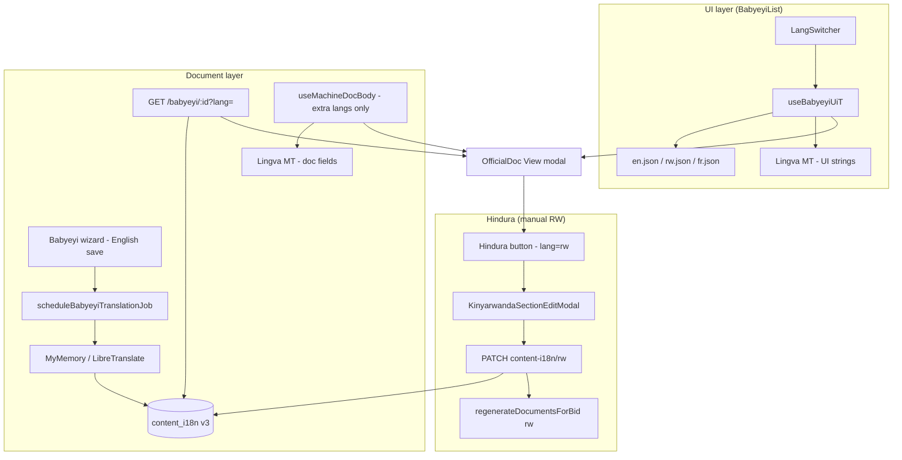

# Babyeyi language translation — developer guide

This document explains how **Babyeyi** handles languages end to end: UI labels, official document text (English source), automatic Kinyarwanda/French generation on the server, client-side preview for extra languages, and **Hindura** (manual Kinyarwanda edits).

---

## 1. Two separate translation systems

Do not confuse these — they use different storage and different code paths.

| Layer | What it translates | Storage | When it runs |
|-------|-------------------|---------|--------------|
| **UI strings** | Buttons, table headers, status labels, section titles (`View`, `Print`, `AMAFARANGA YISHYURWA`, …) | Static JSON files (`en.json`, `rw.json`, `fr.json`) + optional **Lingva** MT in the browser | Every time the user switches language in the list / View modal |
| **Document content** | Parent letter, payment names, requirements, class notes, leader roles — text the school manager typed in English | DB column `school_babyeyi.content_i18n` (v3 JSON bundle) | After create/update (background job); merged on GET/PDF |

**Rule of thumb**

- If the string is the same for every school → **UI i18n JSON**.
- If the string is unique per Babyeyi record (manager typed it) → **English DB row + `content_i18n` triplets** (`en` / `rw` / `fr`).

Legacy column `translations_json` (v1) is **no longer applied** to document bodies. Labels come from i18n JSON; narrative fields come from `content_i18n` or English source rows.

---

## 2. Supported languages

### Core languages (official, offline)

| Code | Language | UI source | Document source |
|------|----------|-----------|-----------------|
| `en` | English | `en.json` | English DB columns (source) |
| `rw` | Kinyarwanda | `rw.json` | `content_i18n` → `*.rw` (auto MT + manual Hindura) |
| `fr` | French | `fr.json` | `content_i18n` → `*.fr` (auto MT only) |

Defined in:

- `babyeyipro/Frontend/web/src/manager/schoolLiteSupport/babyeyiTranslateLangs.js` — `CORE_BABYEYI_LANG_CODES`
- `BabyeyiSystem/backend/utils/babyeyiContentI18n.js` — `LANGS`

### Extra UI languages (browser only)

Swahili, Arabic, Russian, etc. (`BABYEYI_AUTO_LANG_OPTIONS`) are translated **in the browser** via **Lingva** from English UI strings. They do **not** persist document content on the server.

- API calls still use `lang=en` for non-core codes (`apiLang` in `useBabyeyiUiT`).
- Document body fields are machine-translated client-side in `useMachineDocBody` (see §5).

User preference is stored in `localStorage` key `babyeyi_lang`.

---

## 3. UI translation — step by step

### 3.1 Hook: `useBabyeyiUiT(lang)`

**File:** `babyeyipro/Frontend/web/src/manager/schoolLiteSupport/hooks/useBabyeyiUiT.js`

```
User picks language
        │
        ▼
normalizeBabyeyiLang(lang)
        │
        ├── en | rw | fr ──► getLegacyBabyeyiUI(lang) from JSON
        │                    apiLang = same code
        │
        └── other code ────► translateFlatUiRecord(baseEn, "en", lang) via Lingva
                             cache in sessionStorage (babyeyi_mt_ui_v3:{lang})
                             apiLang = "en"
                             machineActive = true
```

Returns `{ T, apiLang, mtLoading, mtError, machineActive }`.

- **`T`** — flat object used across `BabyeyiList.jsx` (same property names as before: `viewBtn`, `editBtn`, `secTotalPayments`, …).
- **`machineActive`** — true when Lingva is translating UI (show spinner on language switcher).

### 3.2 JSON locale files

**Directory:** `babyeyipro/Frontend/web/src/manager/schoolLiteSupport/i18n/`

| File | Role |
|------|------|
| `en.json` | Source of truth for UI keys |
| `rw.json` | Kinyarwanda UI; missing keys fall back to English |
| `fr.json` | French UI; missing keys fall back to English |
| `index.js` | `getLegacyBabyeyiUI()`, `getParentMessageForDisplay()`, helpers |

**Example — Kinyarwanda UI label**

```json
// rw.json
"list": {
  "editBtn": "Hindura"
}
```

So in RW UI mode, the card menu shows **Hindura** instead of **Edit**. That label is **not** stored in `content_i18n`; it is pure UI i18n.

**Example — section title in document chrome**

```json
// rw.json → doc.secTotalPayments
"secTotalPayments": "AMAFARANGA YOSE YISHYURWA"
```

Section titles are UI strings. Payment **names** inside the table are document content from `content_i18n`.

### 3.3 Adding a new UI string

1. Add key under `list` or `doc` in `en.json`.
2. Add the same key in `rw.json` and `fr.json` (or leave empty to fall back to EN).
3. Expose it in `getLegacyBabyeyiUI()` in `i18n/index.js` if it needs a top-level `T.myKey` property.
4. Use `T.myKey` in JSX — never hard-code user-visible text in the list/View UI.

---

## 4. Document content — server pipeline

### 4.1 English is the source of truth

Manager writes content in the wizard (`Babyeyi.jsx`) in English (or the school’s working language). Persisted in normal columns / child tables:

| English source | Table / column |
|----------------|----------------|
| Parent letter | `school_babyeyi.parent_message` |
| Payments | `babyeyi_payments.name` |
| Student requirements | `babyeyi_student_requirements.item`, `.description` |
| Class notes / other info | `babyeyi_class_requirements` (rows **with** `details` → class notes; **without** → other info) |
| Leaders | `babyeyi_leaders` (role) |

Amounts, account numbers, phones, doc IDs, school names are **not** translated.

### 4.2 Background job after save

**File:** `BabyeyiSystem/backend/BabyeyiRoutes/babyeyi.js` — `scheduleBabyeyiTranslationJob(bid, preferredLang)`

Triggered after **POST** (create) and **PUT** (update).

```
POST/PUT babyeyi succeeds
        │
        ▼
scheduleBabyeyiTranslationJob (setImmediate, non-blocking)
        │
        ├── translation_status = "pending"
        ├── buildAndPersistContentI18n(bid)
        │       └── buildContentI18nFromEnglish() — MT each field en → rw, en → fr
        │       └── UPDATE content_i18n, translation_status = complete|partial|failed
        └── if preferredLang is rw or fr → regenerateDocumentsForBid(bid, lang)
```

HTTP response is **not** blocked waiting for translation.

### 4.3 Translation provider (backend)

**File:** `BabyeyiSystem/backend/utils/babyeyiContentTranslator.js`

| Env variable | Meaning |
|--------------|---------|
| `BABYEYI_TRANSLATION_ENABLED=0` | Skip APIs; rw/fr copy English |
| `BABYEYI_TRANSLATION_PROVIDER` | `mymemory` (default) or `noop` |
| `LIBRETRANSLATE_URL` | Fallback when MyMemory fails or returns garbage |
| `LIBRETRANSLATE_API_KEY` | Optional LibreTranslate key |

Skips MT for numbers, emails, phones, doc IDs, very short strings.

### 4.4 `content_i18n` v3 bundle shape

**File:** `BabyeyiSystem/backend/utils/babyeyiContentI18n.js`

```json
{
  "v": 3,
  "sourceLang": "en",
  "generatedAt": "2026-07-26T…",
  "status": "complete",
  "engine": "mymemory",
  "parentMessage": { "en": "…", "rw": "…", "fr": "…" },
  "payments": [{ "name": { "en": "…", "rw": "…", "fr": "…" } }],
  "requirements": [{ "item": {…}, "description": {…} }],
  "classNotes": [{ "item": {…}, "details": {…} }],
  "otherInfos": [{ "item": {…}, "details": { "en": "", "rw": "", "fr": "" } }],
  "leaders": [{ "role": {…} }]
}
```

**`translation_status` on `school_babyeyi`:** `pending` | `complete` | `partial` | `failed` | `manual` (after Hindura save).

### 4.5 Serving localized document on GET

**Endpoint:** `GET /api/babyeyi/:id?lang=rw|fr|en`

1. Load English rows from DB.
2. Load `content_i18n`.
3. `mergeLocalizedBabyeyiPayload({ lang, …, contentI18n })` replaces narrative fields with `triplet[lang]`, falling back to English if rw/fr empty.
4. Response `data.parent_message`, `data.payments[].name`, etc. are already localized.

PDF generation uses the same merge with `?lang=` on `/api/babyeyi/:id/pdf`.

---

## 5. Document preview in the browser

### 5.1 Core languages (en / rw / fr)

**File:** `BabyeyiList.jsx` — `loadFullRecord(sumRec, docLang)`

```js
fetch(`/api/babyeyi/${id}?lang=${docLang}`)
```

For `rw` and `fr`, the API returns merged text from `content_i18n`. **No live MT** in the browser for core langs.

`useMachineDocBody(lang, rec)` short-circuits when `isCoreBabyeyiLang(lang)` — it uses `rec` as returned by the API.

### 5.2 Extra languages (Swahili, Arabic, …)

When user selects a non-core language:

1. UI labels → Lingva (`useBabyeyiUiT`).
2. Document fields → `useMachineDocBody` translates English (or RW template parent letter) via Lingva in the browser:
   - `parentMessage`, `payments[].name`, `requirements`, `classNotes`, `otherInfos`, `leaders`, bank names.
3. **Nothing is saved** to the server for these langs — preview/export only.

**Parent letter special case:** if `parent_message` is empty and lang is `rw`, the official template from `rw.json` → `officialParentMessageRw` is used as MT source (`getParentMessageForMachineTranslation`).

### 5.3 Language switcher

**Component:** `LangSwitcher` in `BabyeyiList.jsx`

- Top section: en, rw, fr.
- Searchable list: auto-translate languages.
- View modal can sync with list language via `globalLang` / `onLangChange`.

---

## 6. Kinyarwanda — automatic translation flow

End-to-end when a manager creates or updates a Babyeyi:

```
1. Manager saves wizard (English content in DB)
2. scheduleBabyeyiTranslationJob runs in background
3. buildContentI18nFromEnglish reads all English narrative fields
4. For each field: translateFieldToRwFr(text)
      → MyMemory en|rw, with LibreTranslate fallback
      → stores { en, rw, fr } triplet
5. content_i18n saved; translation_status updated
6. If document language preference is rw → server regenerates PDF in Kinyarwanda
7. User opens View with lang=rw
8. GET ?lang=rw merges rw triplets into response
9. OfficialDoc renders Kinyarwanda text; UI labels from rw.json (e.g. Hindura, AMAFARANGA YOSE YISHYURWA)
```

If auto MT is weak for a field, the manager can fix it with **Hindura** (§7).

---

## 7. Hindura — manual Kinyarwanda edit

**Hindura** = Kinyarwanda for **Edit** (`T.editBtn` in `rw.json`). In the **View** modal, when document language is **Kinyarwanda** (`lang === "rw"`), inline **Hindura** buttons appear next to editable narrative blocks.

### 7.1 Who can Hindura?

**File:** `BabyeyiList.jsx` — `canSessionEditKinyarwandaRw(session)`

- Requires `session.schoolId`.
- Role must be in `BABYEYI_RW_EDITOR_ROLE_CODES` (e.g. `SCHOOL_ADMIN`, `SCHOOL_MANAGER`, `HEAD_TEACHER`, …) **or** empty role (permissive default).

If denied → alert with `T.rwEditDenied`.

### 7.2 What can be edited?

| Section | PATCH body field | Index |
|---------|------------------|-------|
| Parent message | `parentMessage` | — |
| Payment name | `payments: [{ index, name }]` | row index |
| Requirement item/description | `requirements: [{ index, item, description }]` | row index |
| Other information | `otherInfos: [{ index, item }]` | row index |
| Class note | `classNotes: [{ index, item, details }]` | row index |
| Leader role | `leaders: [{ index, role }]` | row index |

**Not editable via Hindura:** amounts, quantities, bank account numbers, English source rows, UI labels, school description HTML (separate feature).

### 7.3 UI flow (step by step)

```
1. User opens View modal, switches language to Kinyarwanda (rw)
2. Document shows merged RW text from content_i18n
3. User clicks "Hindura" on a section (e.g. parent letter)
4. KinyarwandaSectionEditModal opens
      - Pre-filled with current RW text for that slice
      - Live preview panel (doc.rwEditFooterNote explains save behavior)
5. User edits text → clicks Save (Bika)
6. PATCH /api/babyeyi/:id/content-i18n/rw with partial body
7. Server:
      a. Rebuilds v3 bundle from current English rows (fresh skeleton)
      b. mergeOldBundleIntoFresh — keeps existing rw/fr where indices align
      c. applyRwPatches — overwrites only patched rw fields
      d. translation_status = "manual"
      e. regenerateDocumentsForBid(bid, "rw") — server PDF updated
8. Frontend onRecordRefresh:
      - loadFullRecord(id, lang) again
      - Toast: T.rwSectionSaved
9. View modal shows updated Kinyarwanda; next open loads stored rw from content_i18n
```

**Important:** Hindura updates **`content_i18n` only**, not `parent_message` or payment rows in English. English source stays unchanged; RW override lives in the bundle.

### 7.4 Preserve manual RW on English edit

When English content changes (wizard PUT), `mergeTripletPreserve` in `babyeyiContentI18n.js` keeps non-empty **manual `rw`** values when re-aligning bundle indices, so Hindura work is not wiped unless the row is removed or re-indexed.

---

## 8. API reference (translation-related)

| Method | Path | Purpose |
|--------|------|---------|
| `GET` | `/api/babyeyi/:id?lang=en\|rw\|fr` | Single record with merged narrative |
| `GET` | `/api/babyeyi/:id/pdf?lang=…&download=1` | Localized server PDF |
| `PATCH` | `/api/babyeyi/:id/content-i18n/rw` | Hindura — partial RW overrides + PDF regen |
| `POST` | `/api/babyeyi/:id/regenerate-docs?lang=…` | Force PDF/QR regen |

**PATCH body example (parent message):**

```json
{
  "parentMessage": "Babyeyi dukunda,\n\n…"
}
```

**PATCH body example (payment #2):**

```json
{
  "payments": [{ "index": 1, "name": "Amafaranga y'ishuri" }]
}
```

---

## 9. Architecture diagram



---

## 10. Key files (quick map)

| Area | Path |
|------|------|
| List + View + Hindura UI | `babyeyipro/Frontend/web/src/manager/pages/schoolLite/BabyeyiList.jsx` |
| UI i18n hook | `babyeyipro/Frontend/web/src/manager/schoolLiteSupport/hooks/useBabyeyiUiT.js` |
| Locale JSON | `babyeyipro/Frontend/web/src/manager/schoolLiteSupport/i18n/*.json` |
| Lingva client | `babyeyipro/Frontend/web/src/manager/schoolLiteSupport/lib/lingvaTranslate.js` |
| Lang constants | `babyeyipro/Frontend/web/src/manager/schoolLiteSupport/babyeyiTranslateLangs.js` |
| Legacy bundle (unused for body) | `babyeyipro/Frontend/web/src/manager/schoolLiteSupport/utils/applyBabyeyiTranslations.js` |
| Content i18n merge + Hindura merge | `BabyeyiSystem/backend/utils/babyeyiContentI18n.js` |
| Backend MT provider | `BabyeyiSystem/backend/utils/babyeyiContentTranslator.js` |
| Routes + translation job | `BabyeyiSystem/backend/BabyeyiRoutes/babyeyi.js` |
| DB columns | `BabyeyiSystem/backend/utils/babyeyiSchema.js` |

---

## 11. Developer checklist — new translatable document field

1. **English persistence** — add column/table field; wire wizard POST/PUT.
2. **Include in `buildContentI18nFromEnglish`** — add triplet builder loop in `babyeyiContentI18n.js`.
3. **Include in `mergeLocalizedBabyeyiPayload`** — map localized value on GET/PDF.
4. **Include in `buildFreshV3BundleFromContext` + `applyRwPatches`** if managers should Hindura-edit it.
5. **Frontend View** — render field in `OfficialDoc` / `babyeyiDocFrameView.jsx`.
6. **Hindura (optional)** — add `openRwEdit({ type, index, … })` button when `isRwLocale`; extend `KinyarwandaSectionEditModal` + PATCH body shape.
7. **Do not** add document narrative to UI JSON — only section **titles** belong in `en.json` / `rw.json`.

---

## 12. Troubleshooting

| Symptom | Likely cause | Fix |
|---------|--------------|-----|
| RW document still English after save | Background job not finished or MT disabled | Check `translation_status`; env `BABYEYI_TRANSLATION_ENABLED`; logs `[babyeyi] background translation job` |
| Hindura save 403 | Wrong school or not authenticated | Session `schoolId`; record `school_id` match |
| Hindura button missing | Language not `rw` | Switch View modal to Kinyarwanda |
| UI shows Russian after switching back to EN | Old bug: mt cache on core langs | Fixed in `useBabyeyiUiT` — core langs never use `mtT` |
| Section title wrong in RW | UI key missing in `rw.json` | Add key under `doc.*` in `rw.json` |
| Payment **name** wrong in RW | `content_i18n` not generated or bad MT | Hindura edit; or re-save record to re-run job |
| Extra language preview not in server PDF | By design | Extra langs are client preview only; server PDF supports en/rw/fr |

---

## 13. Glossary

| Term | Meaning |
|------|---------|
| **Hindura** | Kinyarwanda UI label for Edit; also used for inline RW content edit in View |
| **content_i18n** | Server JSON bundle of en/rw/fr triplets for narrative fields |
| **Core lang** | `en`, `rw`, or `fr` — official locales |
| **Lingva** | Free Google Translate proxy used in the **browser** for UI + non-core document preview |
| **Triplet** | `{ en, rw, fr }` object for one translatable string |

---

*Last updated for Babyeyi school-lite manager portal (`BabyeyiList.jsx` + `babyeyi.js` content-i18n v3).*
