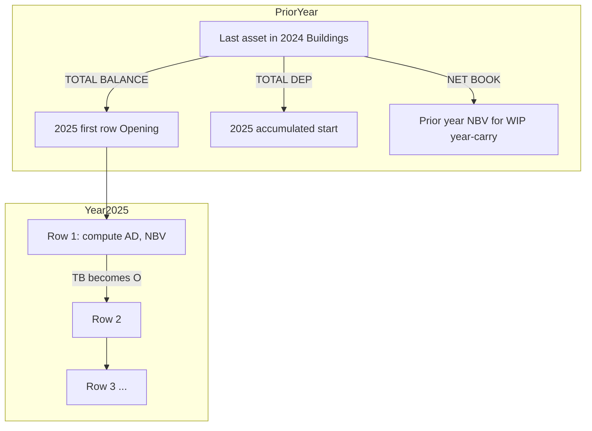

# Assets Portal — Business Rules

Register depreciation, opening stock, and year-carry logic used by the KPS-style asset register.  
**Implementation:** `assets_portal/utils/assetRegisterMath.js` (frontend) and `schoolAssets.js` → `computeAssetRegisterMath()` (backend).

---

## Table of contents

1. [Core register formulas](#1-core-register-formulas)
2. [Register chain (year & within-year)](#2-register-chain-year--within-year)
3. [Standard categories](#3-standard-categories)
4. [Buildings — Finished](#4-buildings--finished)
5. [Buildings — Working Progress (WIP)](#5-buildings--working-progress-wip)
6. [Land (no depreciation)](#6-land-no-depreciation)
7. [Year Setup](#7-year-setup)
8. [Entry modes](#8-entry-modes)
9. [VAT & SKU](#9-vat--sku)
10. [Worked examples](#10-worked-examples)

---

## 1. Core register formulas

Every register row has:

| Field | Symbol | Meaning |
|-------|--------|---------|
| Opening stock | **O** | Carried from prior row or Year Setup |
| Purchase price | **PP** | Unit price (purchase) |
| Total balance | **TB** | O + PP |
| Accumulated dep. (start) | **TD** | Fixed at category year-start |
| Depreciation rate | **R** | % per year (from category) |
| Annual depreciation | **AD** | Charge for this year |
| Total depreciation | **TDep** | TD + AD (or TB − NBV for some WIP cases) |
| Net book value | **NBV** | TB − TDep (or category-specific) |

```
TB = O + PP
```

---

## 2. Register chain (year & within-year)

Assets are grouped by **`category` + `register_year`**, ordered by **`id` ASC**.



### Year boundary (first row in new year)

| Field | Source |
|-------|--------|
| Opening | Prior year **last asset TOTAL BALANCE** |
| Accumulated (TD) | Prior year **last asset TOTAL DEPRECIATION** |
| Prior year NBV | Prior year **last asset NET BOOK VALUE** (Buildings WIP year-carry) |

If no prior register history → use **Year Setup** category balances.

### Within same year (row 2, 3, …)

| Field | Source |
|-------|--------|
| Opening | Previous row **TOTAL BALANCE** |
| Accumulated (TD) | **Unchanged** (category year-start value) |

### Case 2 prior Progress PP

When another **Working Progress** building exists **earlier in the same year**, its purchase price is tracked as `prior_progress_purchase`.

**Critical:** Case 2 PP does **NOT** carry from prior year into the next year.

---

## 3. Standard categories

Applies to: IT Equipment, Furniture, Vehicles, Electronics, Machinery, Laboratory Equipment, Office Equipment, etc.

```
AD = round((TB − TD) × R/100)
TDep = TD + AD
NBV = TB − TDep
```

---

## 4. Buildings — Finished

`building_status = "Finished"`

Annual base: `(PP − TD)` if positive, else `(TB − TD)`

```
AD = round(depreciableBase × R/100)
TDep = TD + AD
NBV = TB − TDep
```

---

## 5. Buildings — Working Progress (WIP)

`building_status = "Working Progress"`  
Aliases: `wip`, `in progress`, `working_progress`

### Annual depreciation

| Case | Condition | Base for AD |
|------|-----------|-------------|
| **Year-carry** | First WIP in new year, opening > 0, prior year NBV > 0 | **Prior year NBV** |
| **Case 1** | No prior WIP same year | `max(0, PP − TD)` or `max(0, O − TD)` |
| **Case 2** | Prior WIP **same year** | `max(0, PP − PriorProgressPP − TD)` |

```
AD = round(base × R/100)
```

### Net book value

| Case | Formula |
|------|---------|
| **Year-carry** | `NBV = Prior year NBV − AD` |
| **Case 1** (no opening) | `NBV = TB − PP − TD` |
| **Case 1** (with opening) | `NBV = O − TD − AD` |
| **Case 2** (same year) | `NBV = TB − PP − TD − PriorProgressPP` |

### Total depreciation (WIP)

When year-carry or finished-style:
```
TDep = TD + AD
```

Otherwise may derive from:
```
TDep = TB − NBV
```

### KPS reference (NEW DINNING HALL)

| Year | AD | NBV | Acc. start (TD) |
|------|-----|-----|-----------------|
| 2024 | 162,730,553 | 3,091,880,509 | 1,288,133,210 |
| 2025 | 154,594,025 | 2,937,286,484 | 1,450,863,763 |

2025 annual = prior year NBV × 5% (year-carry, **not** Case 2 with 2024 PP).

---

## 6. Land (no depreciation)

`category = "Land"` → `isLandCategory()` forces:

| Field | Value |
|-------|-------|
| Dep rate | **0%** |
| TD | **0** |
| AD | **0** |
| TDep | **0** |
| NBV | **= TB** |

### Year Setup (Land)

- Enter **Opening amount only**
- Acc. dep. start = **not used** (0)
- Rate = **0%**
- Closing balance tracks stock value (= opening + purchases)

### Register chain (Land)

```
TB = O + PP
NBV = TB
Next year O = prior year last Land TOTAL BALANCE
```

No depreciation columns apply. Within-year chaining: each new Land row Opening = previous Land row **TOTAL BALANCE**.

### Multi-year schools (Land starts 2018, Active FY 2021)

1. Year Setup **2018** → Land Opening only
2. Register 2018 Land via **Not first time** mode (Closed years)
3. Continue 2019, 2020, … each Opening = prior TOTAL BALANCE
4. **2021 Active** can be used for current Land without moving Land opening to 2021 Year Setup

---

## 7. Year Setup

Financial year wizard creates:

- `school_asset_financial_years` row (`status`: Draft → Active → Closed)
- `school_asset_year_category_balances` per category

### Per-category balance fields

| Field | Purpose |
|-------|---------|
| `opening_balance` | First asset opening when no prior register |
| `accumulated_depreciation` / `_start` | Category year-start TD (0 for Land) |
| `depreciation_rate` | Snapshot of category rate |
| `purchases` | Sum of purchases in FY |
| `annual_depreciation` | Sum of annual dep in FY |
| `closing_balance` | FY end position |

### Rules

- **One Active FY** per school (creating new Active closes others)
- `auto_carry_forward`: opening preview from prior FY closing per category
- `lock_previous_year`: closes prior years on create
- **Land**: opening only, rate 0, accumulated 0

### Year-start annual preview (non-Land)

```
yearStartAnnual = round((opening − accumulatedStart) × rate / 100)
```

Land: always **0**.

---

## 8. Entry modes

| Mode | API `entry_mode` | When used |
|------|------------------|-----------|
| Year Setup | `year_setup` | First asset in category/year; Active FY |
| Legacy / free year | `legacy` | Any register year; edit mode; historical Closed years |

`AddAsset2.jsx` toggle:
- **First time** → Active FY + `year_setup`
- **Not first time** → any year + `legacy`

---

## 9. VAT & SKU

### VAT

- Default **18%** on purchase price (`PURCHASE_TAX_RATE = 0.18`)
- Toggle `apply_tax` in add form
- `tax_amount = round(PP × 0.18)`, `price_incl_tax = PP + tax_amount`
- VAT does **not** affect register TB (TB uses PP only)

### Auto SKU pattern

```
{SCHOOL_ABBR}/{LOCATION_LABEL}/{LABEL_TAG}/{SEQ}
```

Example: `KPS/BLDA/NDH/00001`

Manual SKU must be unique per `(school_id, register_year)`.

### Asset code

Unique per `(school_id, asset_code, register_year)`.

---

## 10. Worked examples

### Example A — Standard category (Furniture)

| | Value |
|---|-------|
| O | 1,000,000 |
| PP | 200,000 |
| TB | 1,200,000 |
| TD | 300,000 |
| R | 10% |
| AD | round((1,200,000 − 300,000) × 0.10) = **90,000** |
| TDep | 390,000 |
| NBV | **810,000** |

### Example B — Land

| | Value |
|---|-------|
| O (Year Setup 2018) | 819,810,000 |
| PP | 50,000,000 |
| TB | 869,810,000 |
| AD | **0** |
| NBV | **869,810,000** |
| Next year O | **869,810,000** |

### Example C — Buildings WIP year-carry (2025)

| | Value |
|---|-------|
| Prior year NBV | 3,091,880,509 |
| O | 4,692,944,946 |
| PP | 95,833,171 |
| TB | 4,788,778,117 |
| TD | 1,450,863,763 |
| R | 5% |
| AD | round(3,091,880,509 × 0.05) = **154,594,025** |
| NBV | 3,091,880,509 − 154,594,025 = **2,937,286,484** |
| TDep | 1,605,457,788 |

---

## Code reference map

| Rule | Frontend | Backend |
|------|----------|---------|
| Core math | `computeAssetRegisterMath()` | `computeAssetRegisterMath()` |
| Buildings WIP | `computeBuildingRegisterMath()` | `computeBuildingRegisterMath()` |
| Land check | `isLandCategory()` | `isLandCategory()` |
| Chain display | `enrichRegisterChainFinancials()` | — |
| Chain persist | — | `recalcRegisterChainInCategory()` |
| Opening API | `assetTestApi.getOpening()` | `resolveCategoryOpeningContext()` |
| Year start state | `resolveCategoryYearStartState()` | `resolveYearStartOpening()` |

---

[← Back to docs index](./README.md) · [Developer Guide](./DEVELOPER_GUIDE.md) · [API Reference](./API_REFERENCE.md)
