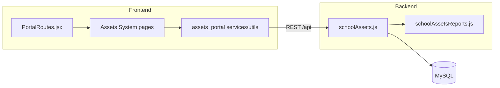
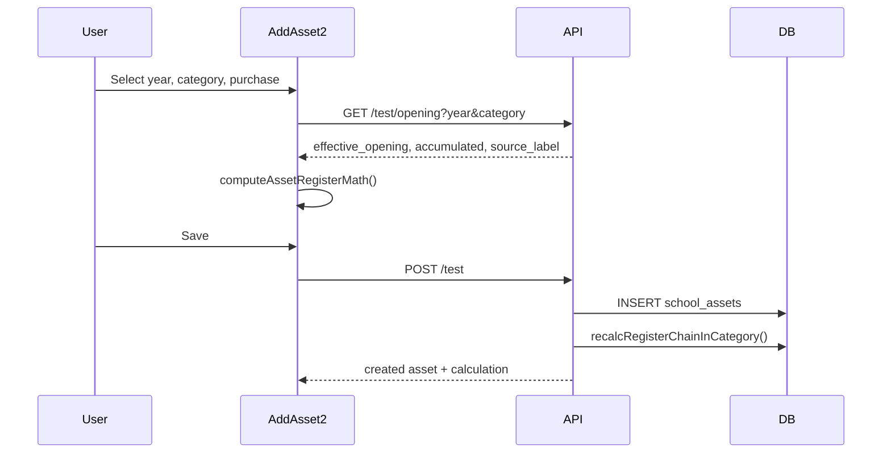
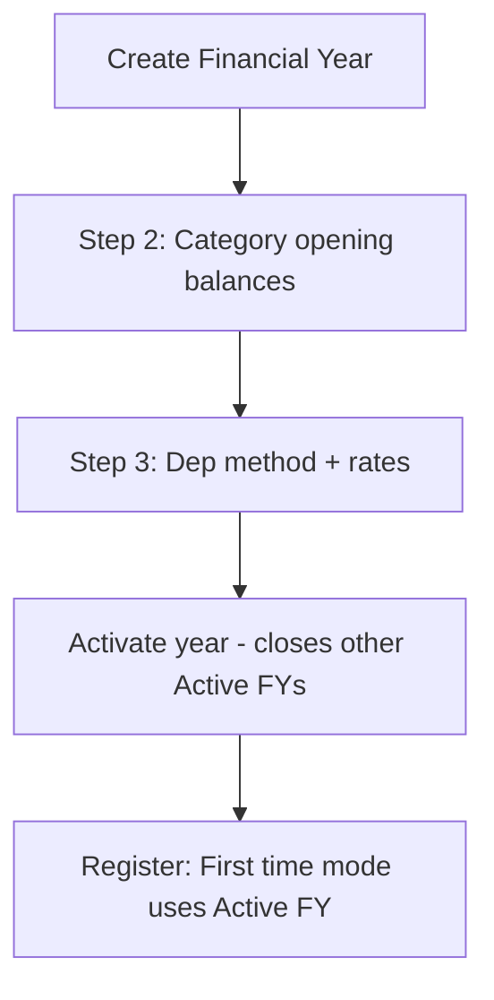

# Assets Portal — Developer Guide

Complete onboarding guide for the Babyeyi Assets Manager Portal: how the frontend and backend are organized, how data flows, and how to extend each feature area.

---

## Table of contents

1. [Architecture](#1-architecture)
2. [Repository layout](#2-repository-layout)
3. [Authentication & roles](#3-authentication--roles)
4. [Routing & navigation](#4-routing--navigation)
5. [Frontend layers](#5-frontend-layers)
6. [Backend structure](#6-backend-structure)
7. [Database model](#7-database-model)
8. [Feature modules](#8-feature-modules)
9. [Register workflow (core)](#9-register-workflow-core)
10. [Year Setup workflow](#10-year-setup-workflow)
11. [Operations modules](#11-operations-modules)
12. [Reports](#12-reports)
13. [QR & public scan](#13-qr--public-scan)
14. [Excel import / export](#14-excel-import--export)
15. [Environment & local dev](#15-environment--local-dev)
16. [Adding a new feature (checklist)](#16-adding-a-new-feature-checklist)
17. [Common pitfalls](#17-common-pitfalls)

---

## 1. Architecture

The portal is a **React SPA** embedded in the main Babyeyi web app. UI pages live in `Assets System/` but are **mounted by** `assets_portal/PortalRoutes.jsx` under `/assets/*`.



**Design principles**

- **Register-first**: The KPS-style asset register (`/test` API) is the source of truth for opening stock, depreciation, and net book value.
- **Client chain math**: The display table recomputes financial columns via `enrichRegisterChainFinancials()` so rows match the edit form.
- **Backend persistence**: Create/update/import triggers `recalcRegisterChainInCategory()` to persist correct openings and totals in `school_assets`.
- **Dual math files**: Frontend `assetRegisterMath.js` mirrors backend `computeAssetRegisterMath()` — changes must stay aligned.

---

## 2. Repository layout

```
Pro/
├── babyeyipro/Frontend/web/src/
│   ├── assets_portal/              ← Portal shell (routes, API, shared utils)
│   │   ├── PortalRoutes.jsx
│   │   ├── config/portal.js
│   │   ├── context/AuthContext.jsx
│   │   ├── services/               ← API clients
│   │   ├── utils/                    ← Register math, constants, Excel, QR
│   │   ├── components/               ← QR, public scan card
│   │   └── docs/                     ← This documentation
│   │
│   └── Assets System/src/          ← Page components & modals
│       ├── components/             ← Layout, Sidebar, modals, tables
│       └── pages/                  ← Dashboard, Register, Year Setup, Ops, Reports
│
└── BabyeyiSystem/backend/
    ├── server.js                   ← app.use('/api', schoolAssetsRoutes)
    └── BabyeyiRoutes/
        ├── schoolAssets.js         ← Schema, math, all asset routes
        └── schoolAssetsReports.js  ← Report handlers
```

### `assets_portal/` — shared portal layer

| Path | Purpose |
|------|---------|
| `PortalRoutes.jsx` | Route tree, auth wrapper, layout |
| `config/portal.js` | `basePath: '/assets'`, `assetsHref()` helper |
| `context/AuthContext.jsx` | Thin wrapper over `MasterAuthContext` |
| `services/assetTestApi.js` | **Register API** (primary) |
| `services/assetsApi.js` | Categories, FY, assignments, maintenance, transfers, replacements |
| `services/reportsApi.js` | Report fetch |
| `services/publicAssetScanApi.js` | Unauthenticated scan |
| `utils/assetRegisterMath.js` | **Core register depreciation math** |
| `utils/assetsConstants.js` | Categories, Buildings/Land helpers, status enums |
| `utils/assetTestExcelImport.js` | Register Excel import preview + payload |
| `utils/assetsQr.js` | QR URL + payload format |
| `utils/financialYearUtils.js` | Year dropdowns, RWF formatting |
| `utils/assetSkuUtils.js` | Auto SKU `SCH/LOC/LBL/00001` |

### `Assets System/src/` — UI pages

| Folder | Contents |
|--------|----------|
| `pages/` | Route-level screens (25+) |
| `pages/Reports/` | Report overview + detail + export |
| `components/` | Reusable UI: `Layout`, `Sidebar`, `AddAsset2`, modals, filters |

---

## 3. Authentication & roles

- Session cookies via `axios` `withCredentials: true`.
- 401 responses redirect to Babyeyi login (`redirectToBabyeyiLogin`).
- Portal gate: `ProGate portal="assets"` in main `App.jsx`.

**Read roles** (`ASSETS_READ_ROLES`):  
`ASSETS_MANAGER`, `ASSET_MANAGER`, `SCHOOL_ADMIN`, `SCHOOL_MANAGER`, `DOS`, `ACCOUNTANT`, `SUPER_ADMIN`, `FULL_SYSTEM_CONTROLLER`

**Write roles** (`ASSETS_WRITE_ROLES`): same list **except** `ACCOUNTANT` (read-only).

---

## 4. Routing & navigation

**Base path:** `/assets` (`portal.js`)

### Active routes (sidebar)

| Path | Page | API focus |
|------|------|-----------|
| `/assets` | Dashboard | `/dashboard` |
| `/assets/asset-add-test` | **Asset Register** | `/test/*` |
| `/assets/year-setup` | Financial Year Setup | `/financial-years` |
| `/assets/analytics` | Analytics | `/analytics` |
| `/assets/categories` | Categories | `/categories` |
| `/assets/reports` | Reports hub | `/reports/:type` |
| `/assets/reports/:slug` | Report detail | `/reports/:type` |
| `/assets/assignments` | Assignments | `/assignments` |
| `/assets/returns` | Returns | assignment return |
| `/assets/transfers` | Transfers | `/transfers` |
| `/assets/replacements` | Replacements | `/replacements` |
| `/assets/maintenance` | Maintenance | `/maintenance` |
| `/assets/purchase-requests` | Procurement | shared module |
| `/assets/scan`, `/assets/view` | QR scan (no layout) | `/public/.../scan` |

### Routes defined but sidebar-hidden

`inventory`, `add-asset`, `preventive`, `warranty`, `depreciation`, `audit`, `lost-damaged`, `disposal`, `qr-barcode`, `notifications`, `users`, `settings`

To enable: uncomment in `Sidebar.jsx` and verify API wiring.

### Adding a route

1. Create page in `Assets System/src/pages/MyPage.jsx`
2. Import + add `<Route>` in `PortalRoutes.jsx`
3. Add nav item in `Sidebar.jsx` `NAV_GROUPS`
4. Use `assetsHref('my-path')` for links (never relative `/my-path` on nested routes)

---

## 5. Frontend layers

### Services (API clients)

All services use `VITE_API_URL` + `/api`.

**`assetTestApi.js`** — register (use for all register work)

```js
getStats(), getMeta(), getOpening(year, category, options)
listAssets({ page, limit, register_year, category, q, ... })
createAsset(payload), updateAsset(id, payload), deleteAsset(id)
importAssets(rows, options), recalcRegisterChain(year, category)
recalcAllRegisterChains(), bulkDelete(ids)
lookupScanAsset({ id, code }), updateAssetHealthStatus(id, status)
```

**`assetsApi.js`** — operations + year setup

```js
listCategories(), createCategory(), updateCategory(), deleteCategory()
listFinancialYears(), createFinancialYear(), updateFinancialYear()
getFinancialYearOpeningPreview(year), getCategoryOpening(year, category)
listAssignments(), createAssignment(), returnAssignment()
listMaintenance(), createMaintenance(), extendMaintenance()
listTransfers(), createTransfer()
listReplacements(), approveReplacement(), rejectReplacement()
getDashboard(), getAnalytics()
```

### Key page ↔ service map

| Page | Primary service | Notes |
|------|-----------------|-------|
| `AssetAddTest.jsx` | `assetTestApi` | Chain display via `enrichRegisterChainFinancials` |
| `AddAsset2.jsx` | `assetTestApi` | Wizard modal; `getOpening()` drives calc panel |
| `YearSetUp.jsx` | `assetsApi` | 4-step FY wizard |
| `Categories.jsx` | `assetsApi` | Category CRUD + dep rate |
| `Assignments.jsx` | `assetsApi` | |
| `Replacements.jsx` | `assetsApi` | Approval workflow |
| `ReportDetailPage.jsx` | `reportsApi` | Excel export via `reportExport.js` |

### Register display math (important)

```js
// AssetAddTest.jsx
const registerFinById = useMemo(
  () => enrichRegisterChainFinancials(assets),
  [assets],
)
const rowFin = (a) => getEnrichedRegisterRow(a, registerFinById)
// Table columns call rowFin(a) for opening, annual_dep, net_book, etc.
```

Backend `mapAssetTestListRow()` returns **stored DB values**; the client chain is the display source of truth. After bulk edits, run **Recalculate register**.

---

## 6. Backend structure

**File:** `BabyeyiSystem/backend/BabyeyiRoutes/schoolAssets.js`

### Schema management

No separate migration files. Tables are created/altered lazily via `ensure*Table()` on first request.

### Core function groups

| Group | Functions |
|-------|-----------|
| **Schema** | `ensureAssetsTable`, `ensureFinancialYearsTable`, `ensureCategoriesTable`, … |
| **Register math** | `computeAssetRegisterMath`, `computeBuildingRegisterMath`, `applyDepreciationMath` |
| **Opening context** | `resolveYearStartOpening`, `resolveCategoryOpeningContext`, `resolveRegisterRollingOpening` |
| **Chain recalc** | `recalcRegisterChainInCategory`, `repairCorruptedCategoryYearStart` |
| **Register CRUD** | `registerAssetWithLedger`, `updateTestAssetWithLedger`, `registerAssetsBulkWithLedger` |
| **Year setup** | `buildOpeningPreview`, `recalcFinancialYearTotals`, `categoryYearStartFromBalance` |
| **Mapping** | `mapAssetRow`, `mapAssetTestListRow`, `mapFinancialYearRow` |
| **SKU** | `resolveAutoSkuForBody`, `assertManualTagSkuAvailable` |
| **Replacements** | `completeAssetReplacement` |

### Reports

`schoolAssetsReports.js` is required from `schoolAssets.js`:

```
GET /api/school/assets/reports/:type
```

Types: `overview`, `all-assets`, `categories`, `financial-years`, `health`, `assignments`, `returns`, `transfers`, `maintenance`, `depreciation`, `damaged-lost`, `locations`

---

## 7. Database model

### `school_assets` (main register table)

| Column group | Fields |
|--------------|--------|
| Identity | `id`, `school_id`, `asset_code`, `asset_name`, `sku`, `serial_number`, `label_tag` |
| Classification | `category`, `location`, `location_label`, `building_status` |
| Register year | `register_year` |
| Financials | `opening_amount`, `unit_price`, `total_balance`, `accumulated_depreciation`, `dep_rate`, `annual_dep`, `total_dep`, `net_book_value`, `decimal_dep` |
| Tax | `tax_amount`, `price_incl_tax` |
| Status | `assets_status`, `asset_health_status`, `condition_code`, `status` |
| Replacement | `replaced_by_asset_id`, `replaces_asset_id`, `replacement_id` |
| Audit | `created_at`, `updated_at`, `deleted_at` |

**Unique:** `(school_id, asset_code, register_year)`

### `school_asset_categories`

`name`, `icon`, `description`, `depreciation_rate` (Land = 0)

### `school_asset_financial_years`

`year`, `start_date`, `end_date`, `dep_method`, `auto_carry_forward`, `lock_previous_year`, `status` (`Draft` | `Active` | `Closed`), aggregate balances

### `school_asset_year_category_balances`

Per financial year + category: `opening_balance`, `last_year_closing`, `purchases`, `accumulated_depreciation`, `accumulated_depreciation_start`, `annual_depreciation`, `closing_balance`, `depreciation_rate`

### Operations tables

- `school_asset_assignments` — staff/place assignments, returns
- `school_asset_maintenance` — tickets, `extension_log` JSON
- `school_asset_transfers` — location/department moves
- `school_asset_replacements` — old/new asset linkage, approval, `pending_payload`

---

## 8. Feature modules

### Dashboard (`Dashboard.jsx`)

Summary cards: total assets, purchase value, net book, assignments, maintenance.  
API: `GET /school/assets/dashboard`

### Asset Register (`AssetAddTest.jsx`) — **primary**

- Paginated table with filters (year, category, health, date period, search)
- Add/Edit via `AddAsset2.jsx` modal
- Excel import via `AssetTestImportModal.jsx`
- Bulk delete, health status, QR codes
- Export Excel, recalculate full register chain
- Deep link: `?asset=123` opens preview drawer

### Year Setup (`YearSetUp.jsx`)

4-step wizard: Year Info → Opening Balances → Rules & Depreciation → Confirmation  
Manages financial years and per-category opening balances. See [Business Rules](./BUSINESS_RULES.md).

### Categories (`Categories.jsx`)

CRUD for `school_asset_categories` including default depreciation rate per category.

### Analytics (`AssetAnalytics.jsx`)

Charts and breakdowns from `/school/assets/analytics`.

### Assignments / Returns / Transfers / Maintenance / Replacements

Standard CRUD + modals pattern. Each module has:
- List page with filters
- Create modal
- View/detail modal
- Excel export via `assetModuleExcelExport.js` (where applicable)

### Replacements (special)

Workflow: request → approve → creates/links new asset.  
Old asset health → `Not Used (Old)`. Links via `replaced_by_asset_id`.

### Purchase Requests

Wrapped procurement module at `/assets/purchase-requests` (`AssetsRequestOrder`).

---

## 9. Register workflow (core)



### Entry modes (`AddAsset2.jsx`)

| Mode | Toggle | Year picker | Opening source |
|------|--------|-------------|----------------|
| **First time (Year Setup)** | `isFirstEntry: true` | Active FY only | Year Setup + register chain |
| **Not first time (legacy)** | `isFirstEntry: false` | Any year from 1900 | Prior year last TOTAL BALANCE |

`assetTestApi.getOpening()` sends `entry_mode: 'year_setup' | 'legacy'`.

### Register chain rules (summary)

Within **category + register_year**, assets ordered by `id`:

1. **First row in year**: opening from prior year last **TOTAL BALANCE** (or Year Setup); accumulated from prior year last **TOTAL DEP**
2. **Subsequent rows**: opening = previous row **TOTAL BALANCE**; accumulated fixed for the year
3. **Buildings WIP**: same-year prior Progress purchase for Case 2; year-carry uses prior year **NBV × rate**
4. **Land**: no depreciation; opening chain by TOTAL BALANCE only

Full formulas: [Business Rules](./BUSINESS_RULES.md)

### Recalculate

- Per year/category: `POST /test/recalc-chain { register_year, category }`
- All years: `POST /test/recalc-chain { all_years: true }`
- UI: "Recalculate register" button on `AssetAddTest.jsx`

---

## 10. Year Setup workflow



**Multi-year schools** (e.g. Land starts 2018, Buildings Active 2021):

- Land historical years: use **Not first time** + register year 2018, 2019, …
- Year Setup Land opening only on the **first** Land year
- Active FY (2021) is for current-year "First time" entries only

Land-specific Year Setup behavior is documented in [Business Rules — Land](./BUSINESS_RULES.md#land-no-depreciation).

---

## 11. Operations modules

| Module | Create endpoint | Key fields |
|--------|-----------------|------------|
| Assignments | `POST /assignments` | `asset_id`, assignee, return date |
| Returns | `PATCH /assignments/:id/return` | condition, notes |
| Transfers | `POST /transfers` | from/to location, department |
| Maintenance | `POST /maintenance` | asset, description, due date |
| Maintenance extend | `PATCH /maintenance/:id/extend` | new due date, log entry |
| Replacements | `POST /replacements` | old asset, reason, pending new asset payload |

Operations do **not** recalculate register depreciation unless they create a new asset via replacement approval.

---

## 12. Reports

Config: `Assets System/src/pages/Reports/reportConfig.js`

| Slug | Report |
|------|--------|
| *(empty)* | Overview |
| `all-assets` | Full register + QR |
| `categories` | By category |
| `financial-years` | By register year |
| `health` | Used vs Not Used (Old) |
| `assignments` | Assigned assets |
| `returns` | Return history |
| `transfers` | Transfer log |
| `maintenance` | Maintenance tickets |
| `depreciation` | FY depreciation summary |
| `damaged-lost` | Exceptions |
| `locations` | By location |

Export: `pages/Reports/utils/reportExport.js` (Excel via `xlsx` or similar).

---

## 13. QR & public scan

**QR payload format** (`assetsQr.js`):

```
CODE:{asset_code}|TAG:{label_tag}|SN:{serial}|ID:{id}
```

**Scan URL:** `/assets/scan?code=...` or `?asset=...`

| Endpoint | Auth | Purpose |
|----------|------|---------|
| `GET /public/school/assets/scan` | None | Public asset card |
| `GET /school/assets/scan-lookup` | Manager | Authenticated lookup |

Components: `AssetQrCode.jsx`, `AssetPublicScanCard.jsx`, `AssetDetailQRScan.jsx`

---

## 14. Excel import / export

### Register import

1. `AssetTestImportModal.jsx` parses Excel client-side
2. `assetTestExcelImport.js` validates rows, runs chain math preview
3. `POST /test/import` persists via `registerAssetsBulkWithLedger`

Column mapping includes: `category`, `type` → category, `purchase_unit_price`, `opening amount`, location fields, etc.

### Register export

`AssetAddTest.jsx` → `exportReportExcel()` with chain-enriched rows (`enrichRegisterChainFinancials` on full export dataset).

### Legacy inventory import

`assetExcelRegister.js` + `POST /school/assets/import` (older path).

---

## 15. Environment & local dev

```env
# babyeyipro/Frontend/web/.env
VITE_API_URL=http://localhost:5100
```

**Backend port:** 5100 (default in `server.js`)  
**Frontend port:** 5174 (Vite)

**Standalone Assets System** (optional): run Vite from `Assets System/` — uses `App.jsx` without `/assets` prefix. Production uses the main web app + `PortalRoutes.jsx`.

**After backend changes:** restart `npm run dev` in `BabyeyiSystem/backend`.

---

## 16. Adding a new feature (checklist)

### New register column

1. Add DB column in `ensureAssetsTable()` migration list
2. Include in `mapAssetRow` / `payloadFromBody` / `registerAssetWithLedger`
3. Add to `AddAsset2.jsx` form + payload
4. Add column in `AssetAddTest.jsx` `buildTableColumns`
5. Update `assetTestExcelImport.js` if importable
6. Update `ALL_ASSETS_REPORT_COLUMNS` in `reportConfig.js` if needed

### New API endpoint

1. Add route in `schoolAssets.js` with `requireRole`
2. Add method in appropriate `services/*.js`
3. Wire page/modal to call service
4. Document in [API Reference](./API_REFERENCE.md)

### New depreciation rule

1. Update `assetRegisterMath.js` (`computeAssetRegisterMath`, chain helpers)
2. Mirror in `schoolAssets.js` `computeAssetRegisterMath`
3. Update `assetTestExcelImport.js` preview chain
4. Document in [Business Rules](./BUSINESS_RULES.md)
5. Add recalc path if existing rows affected

---

## 17. Common pitfalls

| Issue | Cause | Fix |
|-------|-------|-----|
| Table ≠ edit form | Display used per-row math without chain | Use `enrichRegisterChainFinancials` on page assets |
| 2025 WIP annual = 0 | Case 2 PP carried from prior year | `prior_progress_purchase` only same year; use `priorYearNetBook` for year-carry |
| Pagination wrong chain | Chain only on current page | Recalc persists DB; export loads 2000 rows with full chain |
| Land shows depreciation | Default 5% rate fallback | `isLandCategory()` forces rate 0 everywhere |
| Can't add to 2018 | Only Active FY in First time mode | Switch to **Not first time**, pick 2018 |
| Math drift frontend/backend | Only one side updated | Always change both `assetRegisterMath.js` and `schoolAssets.js` |
| Port 5100 in use | Stale node process | Kill process on 5100, restart backend |

---

## Related documents

- [API Reference](./API_REFERENCE.md)
- [Business Rules](./BUSINESS_RULES.md)
- [Docs index](./README.md)
