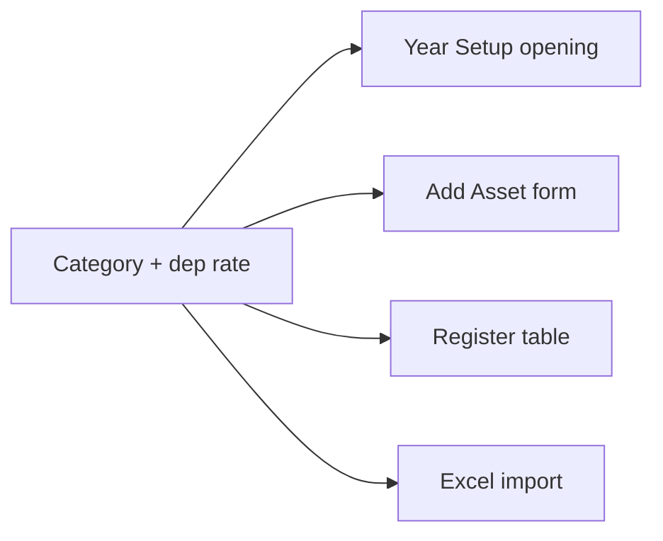

# Chapter 03 — Categories

**Path:** Sidebar → **Categories** → `/assets/categories`

Categories define asset types and their **default depreciation rate**. Every register row is assigned one category.

---

## Default categories (seeded)

| Category | Default rate | Notes |
|----------|--------------|-------|
| IT Equipment | 25% | |
| Furniture | 10% | |
| Vehicles | 20% | |
| Electronics | 25% | |
| Machinery | 15% | |
| Laboratory Equipment | 15% | |
| **Buildings** | **5%** | Supports Finished / Working Progress |
| **Land** | **0%** | No depreciation |
| Office Equipment | 20% | |

---

## Step-by-step: Add a category

1. Open **Categories**.
2. Click **Add Category** (or use **+ Add Category** from Year Setup wizard).
3. Fill the form:

| Field | Required | Example |
|-------|----------|---------|
| **Name** | Yes | `Sports Equipment` |
| **Icon** | No | Pick from icon list |
| **Description** | No | `Balls, nets, gym gear` |
| **Depreciation rate** | Yes | `15` (percent) |

4. Click **Save**.

**Land:** Always set rate to **0**.

---

## Step-by-step: Edit a category

1. Find the category card/row.
2. Click **Edit**.
3. Update name, description, or depreciation rate.
4. Save.

**Warning:** Changing rate affects **new** assets and recalculations — existing rows keep stored rate until recalculated.

---

## Step-by-step: Delete a category

1. Click **Delete** on the category.
2. Confirm.

Categories with existing assets may be blocked from deletion (soft-delete only).

---

## How categories connect to other features

| Feature | Uses category for |
|---------|-------------------|
| Year Setup | Per-category opening balance row |
| Add Asset | Dep rate, Buildings/Land rules |
| Register | Filter, display, chain math |
| Excel import | Type column → category mapping |
| Reports | Group by category |

---

## Excel type → category mapping (import)

When importing, the `type` column maps to categories:

| Excel type | Category |
|------------|----------|
| BUILDING / BUILDINGS | Buildings |
| LAND | Land |
| FURNITURE | Furniture |
| VEHICLE / VEHICLES | Vehicles |
| ICT / IT | IT Equipment |
| … | (see import guide) |

---

[← Year Setup](./02-year-setup.md) · [Features index](../FEATURES_INDEX.md) · [Next: Add Asset Form →](./04-add-asset-form.md)
