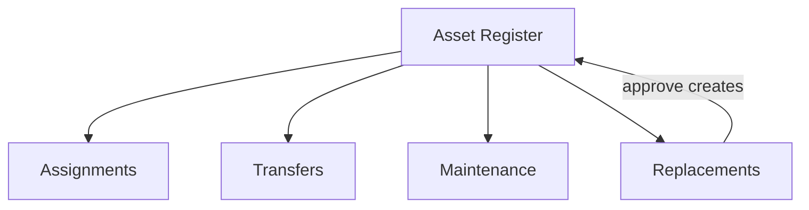

# Chapter 09 — Operations Modules

Operations track asset **movement and lifecycle** after registration. They do not replace the register — they link to register assets.

---

## Assignments

**Path:** `/assets/assignments`

### Purpose
Assign assets to staff, departments, or locations with expected return dates.

### Step-by-step: Create assignment

1. Click **+ New Assignment**.
2. Search/select **asset** (from register).
3. Fill:
   - Assignee name
   - Department / location
   - Assign date
   - Expected return date
   - Notes
4. Save.

### View / manage

| Action | How |
|--------|-----|
| View details | Click row → View modal |
| Return asset | Return action → condition, notes |
| Request maintenance | Link from assignment view |
| Export | Export Excel button |

### Statuses
Active, Returned, Overdue (computed from return date).

---

## Returns

**Path:** `/assets/returns`

### Purpose
History of returned assignments.

### Step-by-step

1. Open **Returns** page.
2. Filter/search returned records.
3. View return condition and damage notes.
4. Export to Excel if needed.

Returns are created from **Assignments** → Return action, not standalone.

---

## Transfers

**Path:** `/assets/transfers`

### Purpose
Move assets between departments, locations, or custodians.

### Step-by-step: Create transfer

1. Click **+ New Transfer**.
2. Select asset.
3. Fill:
   - From location/department
   - To location/department
   - Transfer date
   - Authorized by / received by
   - Reason
4. Save.

### View
Click row for transfer details modal. Export available.

---

## Maintenance

**Path:** `/assets/maintenance`

### Purpose
Track repair and maintenance tickets.

### Step-by-step: Create maintenance request

1. Click **+ New Request**.
2. Select asset.
3. Fill:
   - Issue description
   - Priority
   - Scheduled / due date
   - Estimated cost
4. Save.

### Extend maintenance

1. Open ticket.
2. Click **Extend**.
3. Set new due date and reason.
4. Extension logged in `extension_log`.

### Statuses
Open, In Progress, Completed, Overdue.

---

## Replacements

**Path:** `/assets/replacements`

### Purpose
Replace old assets with new ones (approval workflow).

### Step-by-step: Request replacement

1. Click **+ New Replacement**.
2. Select **old asset** (often Not Used Old).
3. Enter reason, proposed new asset details (or pending).
4. Submit request.

### Approve replacement

1. Open pending replacement.
2. Review old asset financials.
3. Click **Approve**.
4. System creates/links **new register asset**.
5. Old asset marked **Not Used (Old)** with `replaced_by_asset_id`.

### Reject
Click **Reject** with reason.

### Awaiting assets
View replacements approved but waiting for new asset registration.

---

## Purchase Requests

**Path:** `/assets/purchase-requests`

### Purpose
Procurement integration — request purchases from within Assets portal.

Uses shared **AssetsRequestOrder** procurement wrapper (`portalSource="assets"`).

---

## Operations ↔ Register relationship

| Module | Updates register? |
|--------|-----------------|
| Assignments | No (status metadata only) |
| Transfers | No (location may be informational) |
| Maintenance | No |
| Replacements | **Yes** — creates new asset on approve |

---

## Export operations data

Each operations page has **Export Excel** using `assetModuleExcelExport.js`.

---

[← Land & Buildings](./08-land-and-buildings.md) · [Features index](../FEATURES_INDEX.md) · [Next: Reports →](./10-reports.md)
