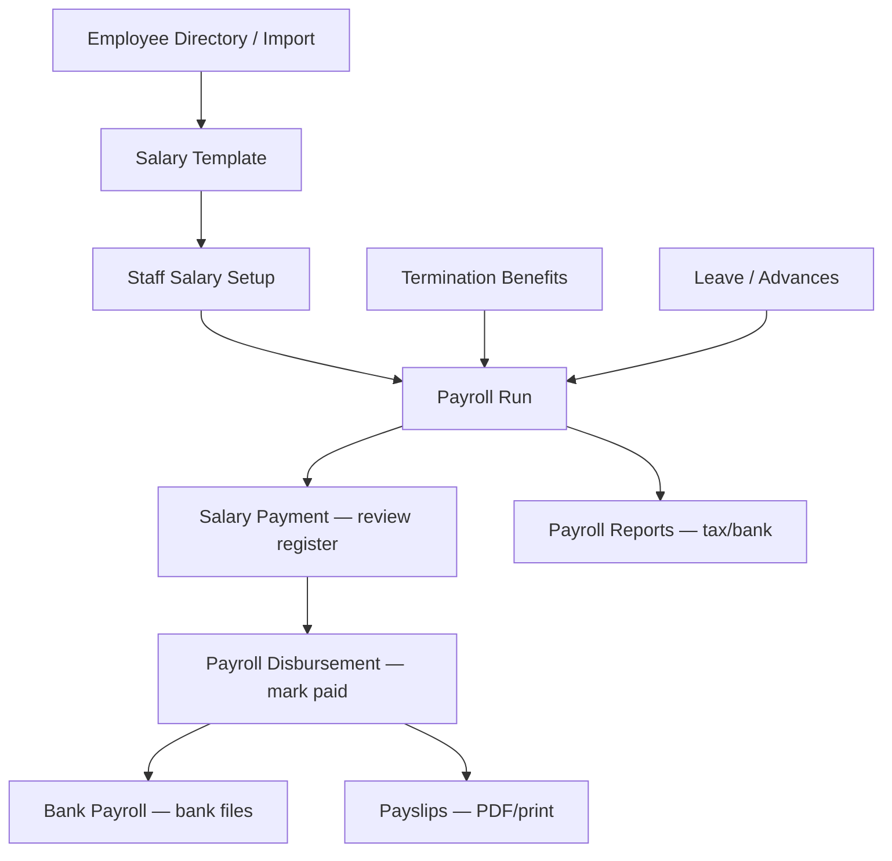

# Accountant Portal — Payroll Module (BabyeyiPro)

> **Portal path:** `/accountant/payroll/*` (embedded) or standalone Vite app on port **5178**  
> **Code root:** `Frontend/web/src/accountant_portal/`  
> **Payroll pages:** `frontend/src/pages/Payroll/`  
> **Routes:** `PortalRoutes.jsx`

The Accountant Payroll module handles Rwanda-compliant salary calculation, monthly payroll runs, tax/bank registers, disbursement, payslips, and termination settlements. It reuses HR employee pages from the Manager portal under `/payroll/employees/*`.

---

## Design language

| Element | Value |
|--------|--------|
| **Hero shell** | `AccountantOchreHero` — navy gradient, amber accent `#F59E0B` |
| **Navy** | `#000435` |
| **Typography** | Bold uppercase labels (10px tracking), semibold body |
| **Cards** | `rounded-2xl`, white, `border-slate-100` |
| **Tables** | `PayrollRegisterTable` / `PayrollReportRegisterTable` — shared register columns |
| **Charts** | Recharts (Payroll Reports) |

---

## Sidebar navigation (Payroll group)

| # | Label | Route | Doc |
|---|-------|-------|-----|
| 1 | Employee Directory | `/payroll/employees` | [07-employees-hr](./07-employees-hr.md) |
| 2 | Employee Import | `/payroll/employees/import` | [07-employees-hr](./07-employees-hr.md) |
| 3 | Payroll Salary Template | `/payroll/salary-template` | [01-salary-template](./01-salary-template.md) |
| 4 | Staff Salary Setup | `/payroll/staff-salary-setup` | [02-staff-salary-setup](./02-staff-salary-setup.md) |
| 5 | Payroll Run | `/payroll/run` | [03-payroll-run](./03-payroll-run.md) |
| 6 | Payroll Reports | `/payroll/reports` | [04-payroll-reports](./04-payroll-reports.md) |
| 7 | Termination Benefits | `/payroll/termination-benefits` | [05-termination-benefits](./05-termination-benefits.md) |
| 8 | Salary Payment | `/payroll/salary-payment` | [06-salary-payment](./06-salary-payment.md) |
| 9 | Payroll Disbursement | `/payroll/disbursement` | [08-payroll-disbursement](./08-payroll-disbursement.md) |
| 10 | Pay Slips | `/payroll/payslips` | [09-payslips](./09-payslips.md) |
| 11 | Bank Payroll | `/payroll/bank-payroll` | [10-bank-payroll](./10-bank-payroll.md) |
| 12 | My Payroll | `/my-payroll` | [11-my-payroll](./11-my-payroll.md) |

**Routed but hidden from sidebar:**

| Route | Page | Doc |
|-------|------|-----|
| `/payroll/leave` | Leave Management (HR) | [07-employees-hr](./07-employees-hr.md) |
| `/payroll/bulk-import` | Bulk Salary Import (mock) | [12-legacy-and-hidden](./12-legacy-and-hidden.md) |
| `/payroll/config` | Configure Payroll (legacy workspace) | [12-legacy-and-hidden](./12-legacy-and-hidden.md) |
| `/payroll/history` | Payroll History (legacy wizard) | [12-legacy-and-hidden](./12-legacy-and-hidden.md) |

**Default landing:** `/payroll` → redirects to `/payroll/run`

---

## End-to-end workflow

---

## Core documentation (for developers)

| Doc | Contents |
|-----|----------|
| [00-architecture](./00-architecture.md) | Folder map, services, shared modules, run statuses |
| [00-payroll-engine](./00-payroll-engine.md) | `rwandaPayrollEngine.js` — PAYE, RSSB, allowances, channels |
| [13-services-and-utils](./13-services-and-utils.md) | API endpoints, utils index, register export |
| [14-recommended-features](./14-recommended-features.md) | Gaps & suggested enhancements |
| [HR Center docs](../hr-center/README.md) | Shared employee profile / registration UI |

---

## Payroll run status lifecycle

| Status | Meaning | Typical page |
|--------|---------|--------------|
| `draft` | Run created, not finalized | Payroll Run |
| `processing` / `processed` | Approved for payment | Salary Payment, Disbursement |
| `paid` | Locked — payments recorded | Payslips, Bank Payroll, Reports |

**Rules (frontend):**

- `isPayrollRunPaid()` — locked, no delete
- `isPayrollRunDeletable()` — only if not paid
- `isPayrollRunLocked()` — same as paid (disbursement)

---

## Key API prefixes

| Service | Base path |
|---------|-----------|
| Runs | `/accountant/payroll/runs` |
| Templates | `/accountant/payroll/templates` |
| Staff payroll profile | `/accountant/payroll/staff/:userId` |
| Employee deductions | `/accountant/payroll/employee-deductions` |
| Disbursement | `/accountant/payroll/disbursement-deduction-rules`, run status |
| Termination | `/accountant/termination-benefits/*` |
| Payslip branding | `/accountant/payroll/payslip-branding` |
| Academic calendar | `/dos/academic-calendar-settings` |

---

## Quick start for new developers

1. Read [00-payroll-engine](./00-payroll-engine.md) — all pages call `calcRwandaPayroll()`.
2. Configure school template → [01-salary-template](./01-salary-template.md).
3. Set per-staff basics → [02-staff-salary-setup](./02-staff-salary-setup.md).
4. Trace a run: `PayrollRun.jsx` → `triggerPayrollRun` → `SalaryPayment` → `PayrollDisbursement`.
5. Register columns live in `utils/payrollRegister.js` and `utils/payrollReportTables.js`.
