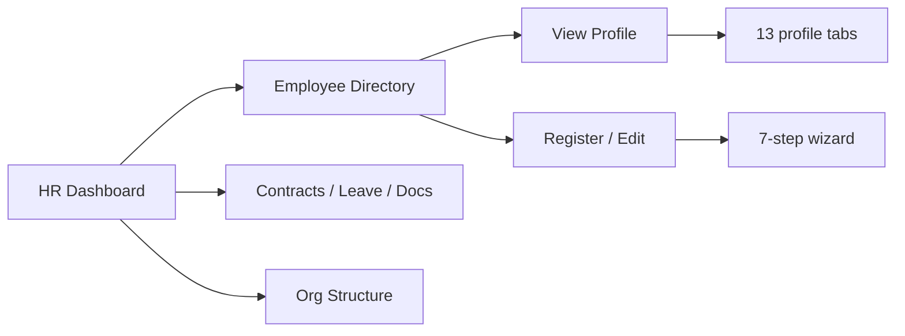

# HR Center — Manager Portal (BabyeyiPro)

> **Portal path:** `/manager/hr/*`  
> **Code location:** `Frontend/web/src/manager/pages/HRPages/`  
> **Navigation config:** `Frontend/web/src/manager/config/hrCenterNav.js`

The **HR Center** is a module inside the **School Manager Portal**. It gives school managers a single place to manage workforce data, contracts, leave, org structure, documents, and qualifications.

---

## Design language

| Element | Value |
|--------|--------|
| **Font** | Montserrat (400 / 500 / 600) |
| **Primary brand** | Ochre `#c87800` |
| **Accent gold** | `#FEBF10` / `#F59E0B` |
| **Navy** | `#000435` |
| **Page shell** | `ManagerOchreHeroShell` — dark navy hero, KPI tiles overlapping content |
| **Cards** | White panels, `rounded-2xl`, light border `border-black/[0.06]`, soft shadow |
| **Inputs** | Rounded-xl, slate borders, ochre focus ring |
| **Badges** | Color-coded by status (Active, Pending, Terminated, etc.) |
| **Icons** | Lucide React, stroke 1.75 |

Every HR page uses the shared `HrPageLayout` wrapper for consistent hero, typography, and spacing.

---

## HR Center menu

| # | Page | Route | Doc |
|---|------|-------|-----|
| 1 | HR Dashboard | `/manager/hr` | [01-hr-dashboard.md](./01-hr-dashboard.md) |
| 2 | Employee Directory | `/manager/hr/directory` | [02-employee-directory.md](./02-employee-directory.md) |
| 3 | Employee Registration | `/manager/hr/registration` | [03-employee-registration.md](./03-employee-registration.md) · [Import UI](./employee-import-registration.md) |
| 4 | Employment Contracts | `/manager/hr/contracts` | [04-employment-contracts.md](./04-employment-contracts.md) |
| 5 | Employment Categories | `/manager/hr/categories` | [05-employment-categories.md](./05-employment-categories.md) |
| 6 | Leave Management | `/manager/hr/leave` | [06-leave-management.md](./06-leave-management.md) |
| 7 | Departments | `/manager/hr/departments` | [07-departments.md](./07-departments.md) |
| 8 | Organization Structure | `/manager/hr/organization` | [08-organization-structure.md](./08-organization-structure.md) |
| 9 | Staff Documents | `/manager/hr/documents` | [09-staff-documents.md](./09-staff-documents.md) |
| 10 | Qualifications | `/manager/hr/qualifications` | [10-qualifications.md](./10-qualifications.md) |

**Related routes (outside HR Center sidebar):**

| Page | Route | Doc |
|------|-------|-----|
| Employee Profile (View) | `/manager/hr/directory/:id` | [11-employee-profile.md](./11-employee-profile.md) |
| Edit Employee | `/manager/hr/directory/:id/edit` | [03-employee-registration.md](./03-employee-registration.md) |
| Payroll overview | `/manager/payroll` | [12-related-hr-features.md](./12-related-hr-features.md) |
| Staff attendance reports | `/manager/reports/attendance/staff` | [12-related-hr-features.md](./12-related-hr-features.md) |
| Termination benefits | `/manager/finance/termination-benefits` | [12-related-hr-features.md](./12-related-hr-features.md) |

---

## User flow (high level)

---

## Backend API (summary)

HR pages call `/school/hr/*` via `hrService.js`:

- Departments — CRUD + seed defaults
- Directory — search, filters, stats
- Employees — get, update, documents
- Leave — requests, stats, balance, status updates

Staff create/delete uses `staffService.js`.

---

## How to open in the app

1. Sign in as **School Manager**
2. Open sidebar → **HR Center**
3. Expand submenu and pick any page above

Sample import files live in `Frontend/web/public/` (`hr-employee-import-sample-50.xlsx`, etc.).

---

## Related: Accountant Payroll

Employee data flows into payroll via the Accountant portal. See **[Accountant Payroll docs](../accountant-payroll/README.md)** for salary template, payroll run, disbursement, and payslips.
