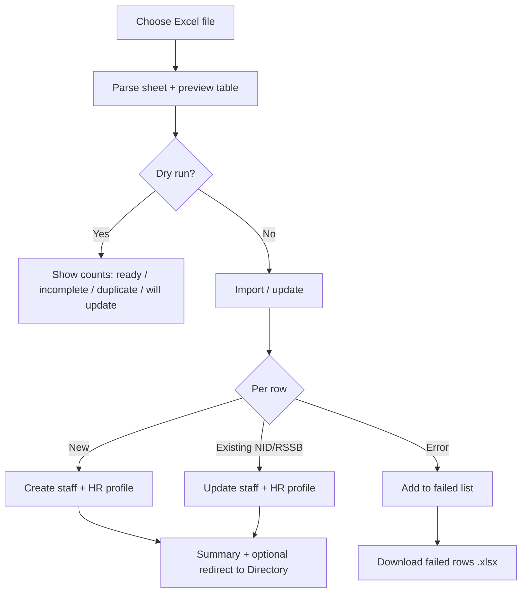

# Employee Import on Registration

How bulk employee import **looks and works** on the Employee Registration page — UI layout, templates, validation, and import actions.

**Component:** `manager/pages/HRPages/EmploymentRegistration.jsx`  
**Template utils:** `manager/utils/hrEmployeeImportTemplate.js`

---

## Where to open it

| Portal | Route | How to get there |
|--------|-------|------------------|
| **Manager HR** | `/manager/hr/registration` | HR Center → Employee Registration |
| **Accountant Payroll** | `/accountant/payroll/employees/import` | Payroll → Employee Import |

Same page and same import modal; accountant mode shows extra payroll allowance columns and labels.

Import is **only on new registration** — not shown in **Edit Employee** mode.

---

## Page layout (registration + import entry)

```
┌──────────────────────────────────────────────────────────────┐
│  HERO — Employee Registration                                │
│  "Create a new employee record"                              │
└──────────────────────────────────────────────────────────────┘
┌──────────────────────────────────────────────────────────────┐
│  WIZARD PANEL (top bar — above stepper)                      │
│                                                              │
│  [ Download import template ]  [ Import from Excel ]       │
│       (white outline)              (navy #000435)            │
│                                                              │
│  ●──●──●──●──●──●──●  7-step horizontal stepper              │
│  Personal → Residence → … → Documents                        │
└──────────────────────────────────────────────────────────────┘
│  Step form content (single employee wizard continues below)  │
└──────────────────────────────────────────────────────────────┘
```

### Top bar buttons (new registration only)

| Button | Style | Action |
|--------|-------|--------|
| **Download import template** | White, slate border, spreadsheet icon | Downloads `.xlsx` template |
| **Import from Excel** | Navy `#000435`, upload icon | Opens wide import modal |

**Manager label:** `Download import template` → full HR template  
**Accountant label:** `Payroll import template (basic + allowances)` → minimal + allowance columns

You can register **one employee** via the wizard **or** bulk import via Excel without leaving this page.

---

## Import modal — overall look

**Title:** `Import employees from Excel`  
**Size:** Wide modal (`HrModal` with `wide` prop)  
**Overlay:** Standard HR modal (white card, rounded corners, footer action bar)

```
┌──────────────── Import employees from Excel ──────────────── × ┐
│                                                              │
│  [Accountant only: green info box about allowance columns]   │
│                                                              │
│  [ Choose Excel file ] [ Sample CSV ] [ Minimal ] [ Full ]   │
│                                                              │
│  ┌─ Sky blue: Columns matched from your file ─────────────┐  │
│  └────────────────────────────────────────────────────────┘  │
│  ┌─ Amber: Incomplete profile warnings ────────────────────┐  │
│  └────────────────────────────────────────────────────────┘  │
│  ┌─ Red: Duplicates (in file or already in system) ────────┐  │
│  │  [ Update existing ] [ Delete & re-import ] [ Remove ] │  │
│  └────────────────────────────────────────────────────────┘  │
│                                                              │
│  ┌─ Preview table (scrollable, max ~40vh) ────────────────┐  │
│  │ Status | Row | First Name | Last Name | …             │  │
│  │ ✓ Ready | 2  | Jeanne     | Murerwa   | …             │  │
│  └────────────────────────────────────────────────────────┘  │
│                                                              │
│  [ Result summary after import / dry run ]                   │
│                                                              │
├──────────────────────────────────────────────────────────────┤
│  [ Close ]  [ Dry run (validate only) ]  [ Import / update ] │
└──────────────────────────────────────────────────────────────┘
```

### Footer buttons

| Button | Style | When enabled |
|--------|-------|--------------|
| **Close** | Outline | Always (disabled while importing) |
| **Dry run (validate only)** | Outline | After file uploaded with rows |
| **Import / update N row(s)** | Primary ochre | When at least one importable row (no in-file duplicates) |

While importing: primary button shows spinner + `Importing…`

---

## Toolbar — file & templates

### Choose Excel file

- Amber-bordered upload chip
- Accepts: `.xlsx`, `.xls`, `.csv`
- On pick: parses sheet, fills preview table, runs validation

### Download helpers

| Button | File |
|--------|------|
| **Sample CSV (public)** | `/hr-employee-import-minimal.csv` |
| **Minimal template** | Generated `.xlsx` — payroll roster columns |
| **Full template** | Generated `.xlsx` — all 46 HR columns + instructions sheet |

Accountant **Minimal** button label: `Payroll template (with allowances)`.

---

## Accountant-only info banner

Green bordered box (`border-emerald-100`, `bg-emerald-50`):

> **Accountant payroll import:** optional columns *Allowance Each (T/H/Others)* or separate T/A, H/A, Others — saved per employee for Payroll Run. If empty, payroll auto-calculates allowances from Basic Salary.

---

## Info panels (after upload)

### 1. Columns matched (sky blue)

Shows detected headers from your file, e.g.:

`RSSB Number · National ID · First Name · Last Name · Gender · Basic Salary · …`

Notes that:

- Header aliases work (`RSSB NUMBER`, `Basic Salary`, etc.)
- Commas in salaries (`549,419`) parse correctly
- Long bank account numbers parse correctly
- Existing employees (same National ID) **update** on import

### 2. Incomplete profile (amber)

Title: **Incomplete profile (will still import — edit in directory after)**

Lists rows with missing optional fields, e.g.:

`Row 5: missing Phone, Email, National ID`

Import can proceed; user fixes later in Employee Directory.

### 3. Duplicates (red)

Two modes:

**A. Already in directory (system match)**

- Message: *Already in directory — will update on import (recommended)*
- Actions:
  - **Update existing (N)** — ochre button, upsert by National ID
  - **Delete & re-import** — red outline, removes old record then imports
- Note: *Update keeps payroll history. Use delete & re-import only for wrong test data.*

**B. Duplicates inside the file**

- Message: *Duplicates in file — remove before import*
- Action: **Remove duplicate rows** — strips dupes from preview
- Blocks those rows from **Import / update** count

Duplicate detail lines example:

`Row 4: National ID '119948…' (duplicate of row 2)`

---

## Preview table

**Header:** `Review before import (N rows)` + `· compact payroll columns` when minimal profile detected.

**Columns:**

| Profile | Columns shown |
|---------|---------------|
| **Minimal** | Status, Row, + detected headers from file |
| **Full** | Status, Row, + all 46 `EMPLOYEE_IMPORT_TEMPLATE_HEADERS` |

**Horizontal scroll** — min width ~900px, max height ~40vh.

### Row status column

| Badge | Color | Meaning |
|-------|-------|---------|
| **✓ Ready** | Green | OK to import |
| **⚠ Incomplete** | Amber | Missing optional fields (tooltip lists them) |
| **↻ Will update** | Sky blue | Matches existing employee in directory |
| **✗ Duplicate** | Red | Duplicate row in file — blocked |

### Row background colors

| Background | Condition |
|------------|-----------|
| Red tint | In-file duplicate OR (minimal import) missing Basic Salary |
| Sky tint | Will update existing employee |
| Amber tint | Incomplete but importable |
| White | Ready |

### Missing cells

Empty required-looking cells show **red text** and `—` in slate/red.

---

## Template column sets

### Full template (46 columns)

Personal, residence, employment, payroll, kin, qualifications — see `EMPLOYEE_IMPORT_TEMPLATE_HEADERS` in `hrEmployeeImportTemplate.js`.

Key groups:

- **Identity:** First/Middle/Last Name, Gender, DOB, phone, email
- **Residence:** Province → Village (birth + current)
- **Employment:** Department, Position Code, Contract Type, Start/End Date
- **Payroll:** Basic Salary, National ID, RSSB, TIN, bank/MoMo fields
- **Kin:** Name, relationship, phone, email, address
- **Qualifications:** Level, institution, year, grade

### Minimal / payroll template

| Column | Purpose |
|--------|---------|
| RSSB Number | Match / upsert key |
| National ID | Match / upsert key |
| First Name | Required for new creates |
| Last Name | Required for new creates |
| Gender | Required for new creates |
| Basic Salary | Payroll register |
| Allowance Each (T/H/Others) | Accountant optional |
| Transport Allowance (T/A) | Accountant optional |
| Housing Allowance (H/A) | Accountant optional |
| Others Allowance | Accountant optional |
| Payment Method | Bank / Mobile Money |
| Bank Name | Disbursement |
| Bank Account Number | Disbursement |

---

## Validation logic

### Required for **new** employees

- First Name, Last Name, Gender

### Strongly expected

- National ID **or** RSSB Number (at least one)

### Optional tracked fields (warn if empty)

Phone, Email, National ID, RSSB, DOB, Basic Salary, Middle Name, Department, Position Code, Contract Type, Start Date

### Duplicate detection

Matches on **Email**, **Phone**, **National ID**, **RSSB**:

- Within the same file → **blocks import** for that row
- Already in system → **upsert** (update recommended)

### Profile auto-detection

`detectImportProfile()` — if file looks like minimal payroll roster → compact columns in preview.

---

## Import actions (logic flow)



### Import / update button

1. Skips in-file duplicate rows
2. **System duplicates:** updates existing first, then creates new rows
3. Shows summary: `X updated, Y new`, or error count
4. On **full success:** closes modal → navigates to Employee Directory

### Update existing (from duplicate panel)

- Confirms: match by National ID, RSSB, phone, email
- Updates only — keeps payroll history

### Delete & re-import

- Confirms deletion of matched directory records by name
- Deletes staff, then re-imports rows from file
- Use only for bad test data

### Download failed rows

Exports `.xlsx` with row data + **Errors** column for failed imports or dry-run invalid rows.

---

## Dry run summary (green/amber box)

Example:

`Dry-run result: 45 valid, 3 invalid, total 48.`

Shows counts:

| Field | Meaning |
|-------|---------|
| `total` | Rows in file |
| `ready` | Importable now |
| `incomplete` | Missing fields (new rows) |
| `duplicate` | In-file duplicates |
| `willUpdate` | Match existing directory |
| `importable` | Rows Import button will process |

---

## After successful import

- Green summary: `Imported: N success (X updated, Y new)`
- Modal closes
- Redirect to **Employee Directory**
- Employees appear with payroll/HR fields from spreadsheet

---

## Also reachable from Directory

**Employee Directory** header:

- **Import** button → same registration/import page
- **Export** → downloads current filtered list as import-template `.xlsx`

---

## Design tokens (import UI)

| Element | Style |
|---------|-------|
| Import button | Navy `#000435`, white text, `rounded-xl` |
| Choose file chip | Amber border `#c87800`, hover amber-50 |
| Matched columns box | Sky-50 / sky-100 border |
| Warnings | Amber-50 |
| Errors / dupes | Red-50 |
| Ready status | Emerald-600 |
| Primary import | Ochre `#c87800` (`HrBtnPrimary`) |

---

## Related docs

- [03-employee-registration.md](./03-employee-registration.md) — full 7-step wizard
- [02-employee-directory.md](./02-employee-directory.md) — export/import entry from directory
- [../accountant-payroll/07-employees-hr.md](../accountant-payroll/07-employees-hr.md) — accountant path remapping
