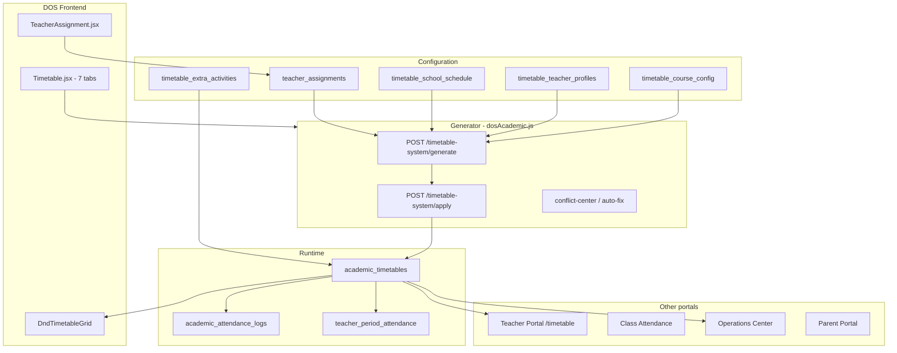

# Timetable — Architecture

## System overview



---

## Repository layout

```
babyeyipro/Frontend/web/src/dos/
├── PortalRoutes.jsx              # /dos/timetable route
├── pages/
│   ├── Timetable.jsx             # Main 7-tab module (~1800 lines)
│   └── TeacherAssignment.jsx     # Permanent assignments CRUD
├── components/
│   ├── DndTimetableGrid.jsx      # Drag-and-drop weekly grid
│   ├── MasterStreamTimetable.jsx # Per-class stream view
│   ├── TeachersTimetablePanel.jsx
│   ├── ExtraActivitiesModal.jsx
│   └── ClassesTimetableOverviewModal.jsx
├── utils/
│   ├── masterTimetableShared.js  # Days, times, subject colors
│   ├── timetableRowUtils.js      # DnD row IDs
│   ├── extraActivityUtils.js     # Capacity checks
│   └── export*TimetablePdf.js    # PDF exporters
└── services/api.js               # Axios → /api/dos/*

BabyeyiSystem/backend/
├── BabyeyiRoutes/dosAcademic.js  # All timetable + generator APIs
├── BabyeyiRoutes/teacherPortal.js # Teacher read + academic_timetables DDL
├── utils/teacherAssignmentsSchema.js
├── utils/timetableDemoSeed.js
└── utils/wisdomP5TimetableSeed.js
```

---

## Route mounting

| Mount | File | Prefix |
|-------|------|--------|
| `app.use('/api', dosAcademicRoutes)` | `dosAcademic.js` | `/api/dos/*` |
| `app.use('/api/teacher-portal', teacherPortalRoutes)` | `teacherPortal.js` | `/api/teacher-portal/*` |

---

## Authentication roles

| Constant | Roles |
|----------|-------|
| `DOS_ACADEMIC_ADMIN` | DOS, SCHOOL_ADMIN, SCHOOL_MANAGER |
| `DOS_DASHBOARD_ROLES` | Above + ACCOUNTANT, SCHOOL_REPRESENTATIVE |

Teacher portal uses teacher session; DOS/HoD can see school-wide timetable.

---

## Database tables

### Runtime — `academic_timetables`

Placed weekly lesson slots (what teachers and students see).

| Column | Purpose |
|--------|---------|
| `school_id`, `class_name`, `subject_name` | Lesson identity |
| `staff_id` | Teacher user ID |
| `day_of_week`, `start_time`, `end_time` | Slot |
| `room` | Optional room |
| `term`, `academic_year` | Scope |
| `extra_activity_id` | Links extracurricular rows |

### Source of truth — `teacher_assignments`

| Column | Purpose |
|--------|---------|
| `teacher_user_id`, `class_name`, `subject_name` | Who teaches what |
| `periods_per_week` | Slots generator must place |
| `academic_year`, `term`, `status` | Scope + archive |
| `room` | Default room |

Used by **marks** (`academic_assessments.teacher_assignment_id`).

### Smart generator config

| Table | Purpose |
|-------|---------|
| `timetable_school_schedule` | Day times, period duration, breaks JSON, active days |
| `timetable_teacher_profiles` | Max periods/day, available days, preferred slots |
| `timetable_course_config` | Lab flag, double period, priority, scheduling rules JSON |
| `timetable_extra_activities` | Extracurricular; synced into `academic_timetables` |

### Attendance support

| Table | Purpose |
|-------|---------|
| `school_periods` | Named periods (break, lunch, teaching) |
| `academic_attendance_logs` | Student attendance per `timetable_id` |
| `teacher_period_attendance` | Teacher gate entry/exit scans |
| `class_teacher_assignments` | Homeroom teachers |

---

## Data flow summary

1. **Configure** assignments + profiles + course rules + schedule.
2. **Generate** proposed slots in memory (`POST /generate`).
3. **Apply** writes to `academic_timetables` (`POST /apply`).
4. **Edit** manually via DnD or CRUD (`POST/PUT/DELETE /dos/timetable`).
5. **Consume** via Teacher Portal, attendance, operations center.

---

## Consumer portals

| Portal | Route | API |
|--------|-------|-----|
| DOS (admin) | `/dos/timetable` | `/api/dos/timetable*` |
| Teacher | `/teacher/timetable` | `/api/teacher-portal/timetable` |
| Discipline | `/discipline/timetable` | Same teacher-portal API |
| Accountant | accountant timetable page | Same |
| Manager | `/manager/timetable` | Legacy `AcademicPlanner.jsx` |

**Canonical stack:** `dos/pages/Timetable.jsx` + `dosAcademic.js`.

---

[← README](./README.md) · [Developer Guide](./DEVELOPER_GUIDE.md) · [API Reference](./API_REFERENCE.md)
