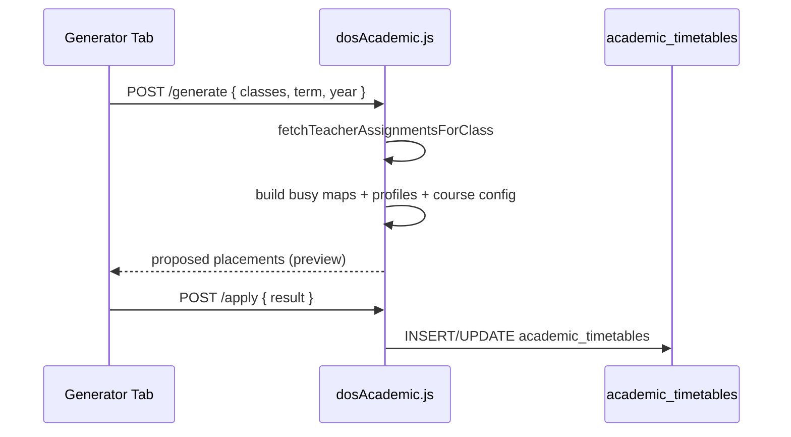

# Timetable — Developer Guide

Complete onboarding for engineers building or extending the DOS Timetable module.

---

## Table of contents

1. [Where to start](#1-where-to-start)
2. [Frontend structure](#2-frontend-structure)
3. [Backend structure](#3-backend-structure)
4. [The 7 tabs explained](#4-the-7-tabs-explained)
5. [Generator pipeline](#5-generator-pipeline)
6. [Drag-and-drop grid](#6-drag-and-drop-grid)
7. [Teacher assignments integration](#7-teacher-assignments-integration)
8. [Conflict system](#8-conflict-system)
9. [Extra activities](#9-extra-activities)
10. [PDF export](#10-pdf-export)
11. [Seeding test data](#11-seeding-test-data)
12. [Adding a feature checklist](#12-adding-a-feature-checklist)
13. [Common pitfalls](#13-common-pitfalls)

---

## 1. Where to start

| Task | Start here |
|------|------------|
| Change generator logic | `dosAcademic.js` → `runMultiClassGeneration`, `generateTimeSlots` |
| Change timetable UI tab | `dos/pages/Timetable.jsx` → search `activeTab ===` |
| Fix DnD behavior | `DndTimetableGrid.jsx` + `timetableRowUtils.js` |
| Add API endpoint | `dosAcademic.js` + `dos/services/api.js` usage in page |
| Teacher view | `teacherPortal.js` + `teacher/pages/Timetable.jsx` |
| Assignment CRUD | `TeacherAssignment.jsx` + `teacherAssignmentsSchema.js` |

---

## 2. Frontend structure

### `Timetable.jsx` state model

The page loads parallel data on mount / term change:

```javascript
api.get('/dos/timetable', { params: { term, academic_year } })
api.get('/dos/timetable-system/teacher-profiles')
api.get('/dos/timetable-system/course-config')
api.get('/dos/timetable-system/assignments')
api.get('/dos/timetable-system/schedule')
api.get('/dos/timetable-system/workload')
api.get('/dos/timetable-system/extra-activities', ...)
```

Tab navigation uses URL: `/dos/timetable?tab=generator`

### Key components

| Component | Role |
|-----------|------|
| `DndTimetableGrid` | Weekly grid with HTML5 DnD; calls `PUT /dos/timetable/:id` on drop |
| `MasterStreamTimetable` | All class streams in one view |
| `TeachersTimetablePanel` | Teacher-centric weekly view |
| `ExtraActivitiesModal` | CRUD extracurricular + sync |
| `ClassesTimetableOverviewModal` | Coverage stats (placed vs expected) |

### Utils

| File | Role |
|------|------|
| `masterTimetableShared.js` | `WEEK_DAYS`, `normalizeTime`, `paletteForSubject`, merge extra activities |
| `timetableRowUtils.js` | Row IDs for DnD, drag payload shape |
| `extraActivityUtils.js` | `getTeachingSlots`, capacity validation |
| `exportClassTimetablePdf.js` | Single class PDF |
| `exportTeacherTimetablePdf.js` | Single teacher PDF |
| `exportMasterTimetablePdf.js` | All streams PDF |

### API client

`dos/services/api.js` — axios with credentials, base `VITE_API_URL/api`.

---

## 3. Backend structure

### `dosAcademic.js` (~8,800 lines)

Major function groups:

| Group | Functions |
|-------|-----------|
| Schema | `ensureSmartTimetableTables`, `ensureAcademicTables` (via teacherPortal) |
| Slots | `generateTimeSlots` — builds Period 1, 2, … + breaks from schedule |
| Generator | `runMultiClassGeneration`, `placeAssignmentPeriods` |
| Apply | Writes generator output → `academic_timetables` |
| Conflicts | `findTeacherPeriodConflicts`, `scanTimetableConflicts`, `autoFixTimetableConflicts` |
| Extra activities | `syncExtraActivityToTimetable`, `validateExtraActivityPlacement` |
| CRUD | `GET/POST/PUT/DELETE /dos/timetable` |

### `teacherAssignmentsSchema.js`

- CRUD for `teacher_assignments`
- `syncTeacherAssignmentsToTimetable` / `syncTeachingAssignmentsFromTimetable`
- Archive / supersede / history

### `teacherPortal.js`

- `ensureAcademicTables()` creates `academic_timetables`
- `GET /teacher-portal/timetable` — teacher's schedule with fallback matching

---

## 4. The 7 tabs explained

| Tab ID | UI section | Primary API |
|--------|------------|-------------|
| `teachers` | Teacher profile cards + edit form | `GET/PUT /timetable-system/teacher-profiles` |
| `courses` | Subject config list + modal | `GET/PUT /timetable-system/course-config/:subject` |
| `schedule` | Day times, breaks, active days | `GET/PUT /timetable-system/schedule` |
| `generator` | Class picker, generate, apply, clear | `POST /generate`, `/apply`, `/clear-timetables` |
| `timetable` | Class DnD grid + teacher sub-view | `GET/POST/PUT/DELETE /dos/timetable` |
| `master-timetable` | Stream overview | Same timetable data + PDF export |
| `conflicts` | Conflict list + auto-fix | `GET /conflict-center`, `POST /auto-fix` |

---

## 5. Generator pipeline



### Inputs per class

- `teacher_assignments` with `periods_per_week`
- `timetable_teacher_profiles` (max periods/day, available days)
- `timetable_course_config` (priority, lab, double period, scheduling rules)
- `timetable_school_schedule` (slot grid)
- Existing `academic_timetables` (teacher busy map)
- `timetable_extra_activities` (reserved slots)

### Outputs

- Proposed array of `{ class_name, subject_name, staff_id, day_of_week, start_time, end_time, room }`
- Coverage report: placed vs expected periods per assignment

---

## 6. Drag-and-drop grid

`DndTimetableGrid.jsx`:

1. Renders rows = time slots, columns = weekdays
2. Each cell = lesson card or empty drop zone
3. On drop: `PUT /dos/timetable/:id` with new `day_of_week`, `start_time`, `end_time`
4. Backend runs `findTeacherPeriodConflicts` → `TEACHER_PERIOD_CONFLICT` if teacher double-booked

Row identity helpers in `timetableRowUtils.js`.

---

## 7. Teacher assignments integration

**`teacher_assignments` is source of truth** for:
- How many periods to place (`periods_per_week`)
- Marks recording (`teacher_assignment_id` on assessments)

**Generator reads assignments** — placed timetable does not auto-update assignment counts on DnD.

Sync endpoints:
- `POST /dos/teacher-assignments/sync-to-timetable`
- `POST /dos/teacher-assignments/sync-from-timetable`

UI: separate page `TeacherAssignment.jsx` at `/dos/teacher-assignments`.

---

## 8. Conflict system

### On manual save (`POST/PUT /dos/timetable`)

`TEACHER_PERIOD_CONFLICT` — same teacher, overlapping time, different class.

### Conflict Center scan types

| Type | Description |
|------|-------------|
| `teacher_clash` | Teacher in two classes same slot |
| `rule_violation` | Subject outside morning/afternoon/custom window |
| `lesson_overlap` | Class double-booked |
| `extra_overlap` | Extra activity collides with teaching slot |

`POST /timetable-system/auto-fix` attempts automatic resolution.

---

## 9. Extra activities

- Stored in `timetable_extra_activities`
- `syncExtraActivityToTimetable()` writes to `academic_timetables` with `extra_activity_id`
- `validateExtraActivityPlacement()` checks capacity vs teaching slots
- UI: `ExtraActivitiesModal.jsx` from Timetable page

---

## 10. PDF export

| Export | Util | Trigger |
|--------|------|---------|
| Class timetable | `exportClassTimetablePdf.js` | Timetable tab → Download |
| Teacher timetable | `exportTeacherTimetablePdf.js` | Teachers panel |
| Master (all streams) | `exportMasterTimetablePdf.js` | Per Class tab |

Uses `html2canvas` / jsPDF pattern (see export utils).

---

## 11. Seeding test data

| Method | Command / action |
|--------|------------------|
| Demo seed UI | Generator tab → Seed demo |
| Demo seed CLI | `node scripts/seed-timetable-demo.js` |
| Wisdom P5 UI | Generator → Seed Wisdom P5 |
| Wisdom P5 CLI | `node scripts/seed-wisdom-p5-timetable.js --school-id=7` |

Demo password: `Timetable123` / Wisdom: `Wisdom2026`

---

## 12. Adding a feature checklist

### New scheduling rule

1. Add field to `timetable_course_config` migration in `ensureSmartTimetableTables`
2. Add UI in Courses tab (`Timetable.jsx`)
3. Enforce in `runMultiClassGeneration` and `scanTimetableConflicts`
4. Document in [BUSINESS_RULES.md](./BUSINESS_RULES.md)

### New timetable column/field

1. Migrate `academic_timetables`
2. Update `POST/PUT /dos/timetable` handlers
3. Update `DndTimetableGrid` card display
4. Update teacher portal read if teachers should see it

### New tab

1. Add to `TABS` array in `Timetable.jsx`
2. Add `activeTab === 'your-tab'` section
3. Link from DOS Sidebar if needed

---

## 13. Common pitfalls

| Issue | Cause | Fix |
|-------|-------|-----|
| Generator places 0 periods | No `teacher_assignments` for class | Add assignments first |
| Teacher clash on DnD | Valid conflict | Move slot or change teacher |
| Empty teacher portal timetable | Wrong term/year or no `staff_id` on rows | Check filters + assignments |
| Manager planner broken | Calls non-existent `/dos/timetable/master` | Use DOS Timetable page |
| Marks missing assignment | Assignment archived or wrong term | Teacher Assignments page |
| Extra activity overlap | Slot already teaching | Validate before save |

---

[← Architecture](./00-architecture.md) · [API Reference](./API_REFERENCE.md) · [Features](./FEATURES_INDEX.md)
