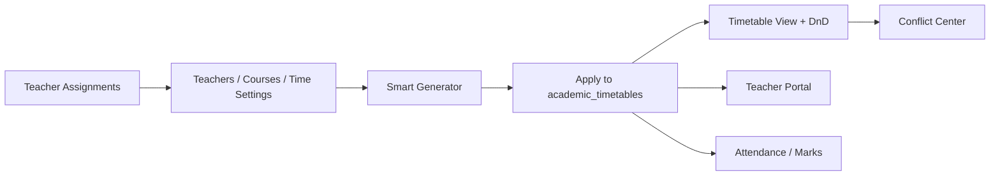

# Timetable Module — Documentation Hub

> **Portal path:** `/dos/timetable`  
> **Code (frontend):** `babyeyipro/Frontend/web/src/dos/`  
> **Code (backend):** `BabyeyiSystem/backend/BabyeyiRoutes/dosAcademic.js`  
> **Teacher read API:** `BabyeyiSystem/backend/BabyeyiRoutes/teacherPortal.js`

The **Timetable module** is the school scheduling system inside the **DOS (Directorate of Studies) portal**. It configures teachers, courses, time slots, auto-generates weekly timetables, resolves conflicts, and feeds **attendance**, **marks**, and **teacher portal** views.

---

## Quick start (developers)

```bash
# Backend
cd BabyeyiSystem/backend
npm install
npm run dev          # http://localhost:5100

# Frontend
cd babyeyipro/Frontend/web
npm install
npm run dev          # http://localhost:5174/dos/timetable
```

Set `VITE_API_URL=http://localhost:5100` in `.env`.

**Roles:** DOS, SCHOOL_ADMIN, SCHOOL_MANAGER (full access). Teachers see read-only schedule via Teacher Portal.

---

## Documentation index

### User & feature guides (step-by-step)

| Document | Description |
|----------|-------------|
| [**FEATURES_INDEX.md**](./FEATURES_INDEX.md) | Chapter hub + learning path |
| [**FEATURES_COMPLETE.md**](./FEATURES_COMPLETE.md) | **All features in one manual** (Word-friendly) |
| [**features/**](./features/) | Step-by-step guides per tab/feature |

### Technical reference

| Document | Description |
|----------|-------------|
| [**00-architecture.md**](./00-architecture.md) | System diagram, data flow, tables |
| [**DEVELOPER_GUIDE.md**](./DEVELOPER_GUIDE.md) | Code layout, extending generator, pitfalls |
| [**API_REFERENCE.md**](./API_REFERENCE.md) | All `/dos/timetable*` endpoints |
| [**BUSINESS_RULES.md**](./BUSINESS_RULES.md) | Generator logic, conflicts, scheduling rules |

### Related docs elsewhere

| Location | Coverage |
|----------|----------|
| [docs/teacher-portal/](../../docs/teacher-portal/) | Teacher read-only timetable + attendance |
| [BabyeyiSystem/backend/scripts/seed-wisdom-p5-timetable.md](../../../BabyeyiSystem/backend/scripts/seed-wisdom-p5-timetable.md) | Wisdom P5 seed CLI |

---

## Timetable workflow (high level)



| Step | User action | Tab / page |
|------|-------------|------------|
| 1 | Assign teachers to class + subject + periods/week | **Teacher Assignments** (`/dos/teacher-assignments`) |
| 2 | Set teacher availability & max periods | **Teachers** tab |
| 3 | Configure subject rules (lab, morning, priority) | **Courses** tab |
| 4 | Set school day times & breaks | **Time Settings** tab |
| 5 | Generate & apply timetables | **Generator** tab |
| 6 | Review, drag-drop edit, export PDF | **Timetable** / **Per Class** tabs |
| 7 | Fix clashes | **Conflict Center** tab |

---

## Seven tabs on `/dos/timetable`

| Tab | URL param | Purpose |
|-----|-----------|---------|
| Teachers | `?tab=teachers` | Teacher profiles (max periods, availability) |
| Courses | `?tab=courses` | Per-subject scheduling config |
| Time Settings | `?tab=schedule` | Day start/end, period length, breaks |
| Generator | `?tab=generator` | Auto-generate multi-class timetables |
| Timetable | `?tab=timetable` | Class + teacher views, drag-and-drop |
| Per Class Timetable | `?tab=master-timetable` | All streams overview + master PDF |
| Conflict Center | `?tab=conflicts` | Scan & auto-fix clashes |

**Separate page:** [Teacher Assignments](./features/02-teacher-assignments.md) → `/dos/teacher-assignments`

---

## Key files (quick reference)

| Layer | File |
|-------|------|
| Main UI | `dos/pages/Timetable.jsx` |
| Assignments UI | `dos/pages/TeacherAssignment.jsx` |
| DnD grid | `dos/components/DndTimetableGrid.jsx` |
| Backend APIs | `BabyeyiRoutes/dosAcademic.js` |
| Assignments schema | `backend/utils/teacherAssignmentsSchema.js` |
| Teacher read | `BabyeyiRoutes/teacherPortal.js` |
| API client | `dos/services/api.js` |

---

## Export to Word

Open `FEATURES_COMPLETE.md` in Microsoft Word, or:

```powershell
pandoc FEATURES_COMPLETE.md -o Timetable-Manual.docx
```

---

*Babyeyi Timetable Module — DOS Portal*
