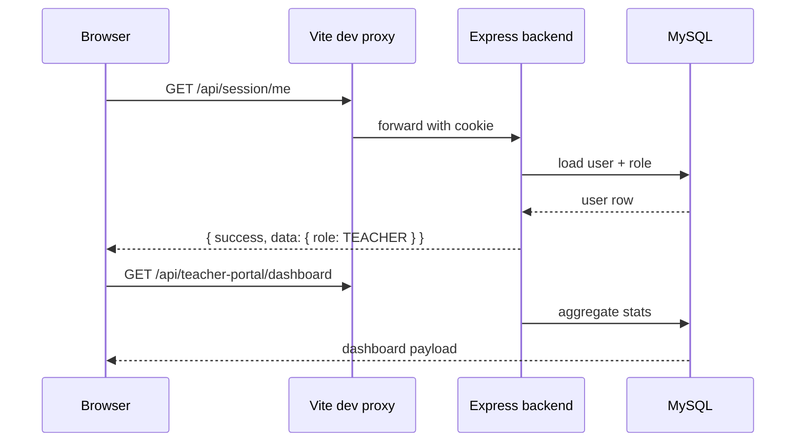

# Teacher Portal — Architecture

## System overview

The Teacher Portal is a **client-only React application** that talks to the **BabyeyiSystem Express backend**. There is no separate teacher API server. All business logic, validation, and persistence live in `BabyeyiSystem/backend`.

```
teacher-portal/          ← React 19 + Vite 8 + Tailwind 4
    │
    │  HTTPS /api/*  (cookie session)
    ▼
BabyeyiSystem/backend/   ← Express 5 + MySQL
    ├── BabyeyiRoutes/teacherPortal.js
    ├── BabyeyiRoutes/portalOperations.js
    ├── BabyeyiRoutes/shuleAvanceServices.js
    └── auth + session middleware
```

---

## Tech stack

### Frontend (`teacher-portal/`)

| Layer | Choice |
|-------|--------|
| Framework | React 19 |
| Build | Vite 8 (`--port 5173 --strictPort`) |
| Routing | React Router 7 |
| Styling | Tailwind CSS 4 (`@tailwindcss/vite`) |
| HTTP | Axios (`withCredentials: true`) |
| Charts | Recharts |
| QR | html5-qrcode |
| Realtime | socket.io-client (chat) |
| Export | xlsx, jsPDF |

### Backend

| Layer | Choice |
|-------|--------|
| Runtime | Node.js |
| Framework | Express 5 |
| Database | MySQL via `mysql2` promise pool |
| Auth | `express-session` (httpOnly cookies) |
| Passwords | bcrypt |

---

## Folder map (standalone app)

```
teacher-portal/
├── index.html
├── vite.config.js              # Dev proxy /api → localhost:5100
├── package.json
├── public/
│   ├── sw.js                   # Service worker (web push)
│   └── favicon.svg
└── src/
    ├── main.jsx
    ├── App.jsx                 # Top-level routes
    ├── index.css
    ├── config/
    │   └── portal.js           # Portal-specific constants
    ├── context/
    │   └── AuthContext.jsx     # Session + SSO + login
    ├── services/
    │   ├── api.js              # Shared Axios instance
    │   ├── marksApi.js         # Marks hub API helpers
    │   └── chatApi.js          # Chat REST helpers
    ├── components/
    │   ├── Layout.jsx          # Shell: sidebar + top nav + outlet
    │   ├── Sidebar.jsx
    │   ├── TopNav.jsx
    │   ├── BottomNav.jsx
    │   └── …modals, QR, timetable widgets
    ├── pages/
    │   ├── Dashboard.jsx
    │   ├── Attendance.jsx
    │   ├── ShuleAvance.jsx     # TichaAvance UI
    │   ├── TichaDeals*.jsx
    │   ├── StudentsMarksPages/ # Full marks & exams hub
    │   └── …
    ├── procurement/            # Purchase request module
    ├── hooks/
    ├── utils/
    └── styles/
```

---

## Embedded copies

When a school uses **Lite** (no Pro subscription), teachers are routed to the in-app portal at `/lite/teacher`. Pro schools use either `babyeyipro` at `/teacher` or the standalone `ticha.babyeyi.rw`.

| Copy | Root path | Feature parity |
|------|-----------|----------------|
| Standalone | `teacher-portal/` | **Full** — marks hub, QR scan, purchase requests |
| Lite | `BabyeyiSystem/frontend/src/lite/teacher/` | Subset — no marks hub, no classroom scan |
| Pro | `babyeyipro/Frontend/web/src/teacher/` | Subset + equipment requests |

Routing logic: `BabyeyiSystem/frontend/src/utils/teacherPortalEntry.js`

---

## Backend modules consumed

| Module | Mount | Used for |
|--------|-------|----------|
| `teacherPortal.js` | `/api/teacher-portal` | Dashboard, students, timetable, attendance, marks, payroll alias |
| `portalOperations.js` | `/api/teacher-portal` | Requisitions, permissions, inventory equipment |
| `auth` routes | `/api/auth`, `/api/session` | Login, logout, SSO, profile photo |
| `shuleAvanceServices.js` | `/api/services/shule-avance` | TichaAvance, TichaDeals |
| Chat routes | `/api/chat` | Staff messaging |
| TichaAI | `/api/tools/ticha-ai` | AI assistant |
| Procurement | `/api/procurement` | Purchase requests |
| DOS academic | `/api/dos` | Subjects, registry classes (gradebook) |
| School calendar | `/api/school/calendar-events` | Calendar events |

---

## Request flow (typical page load)



In production, `VITE_API_URL` points directly at the API host; the Vite proxy is dev-only.

---

## Schema bootstrap

`teacherPortal.js` exports `ensureAcademicTables()` (also imported by DOS and parent portals). On server start or first request, it **creates or alters** academic tables (`academic_timetables`, `academic_marks`, attendance tables, etc.). Do not assume migrations alone — check `ensureTeacherTables` in `teacherPortal.js` when adding columns.

---

## Cross-portal reuse

Other portals call teacher-portal endpoints for shared school data:

- **DOS portal** — timetable, attendance module, students
- **Discipline portal** — student lists, permissions
- **Representative portal** — class data
- **Accountant portal** — payroll views

When changing `/api/teacher-portal/*`, verify impact on these consumers.
