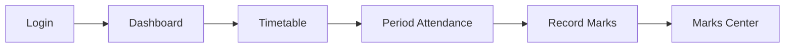
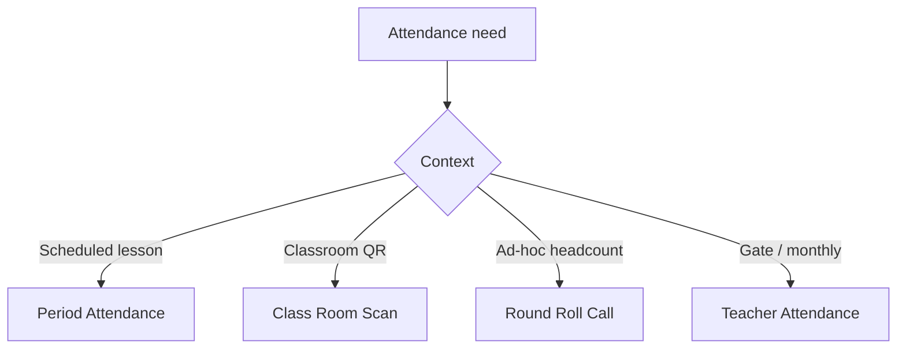

# Teacher Portal — Features & Routes

This document maps every user-facing feature to its route, page component, and primary API calls. Use it as a rebuild checklist.

---

## Route index (`App.jsx`)

| Route | Page component | Feature summary |
|-------|----------------|-----------------|
| `/login` | `Login.jsx` | Email/staff code + password + optional school code |
| `/` | `Dashboard.jsx` | Today’s timetable, quick stats, shortcuts |
| `/students` | `Students.jsx` | Class-filtered student roster |
| `/timetable` | `Timetable.jsx` | Teacher weekly timetable |
| `/english-club` | `EnglishClub.jsx` | Curated English Club resources |
| `/attendance` | `Attendance.jsx` | Period attendance tied to timetable |
| `/class-room-scan` | `ClassRoomScan.jsx` | QR scan for class-period check-in |
| `/round-roll-call` | `RoundRollCall.jsx` | Whole-class roll call sessions |
| `/teacher-attendance` | `TeacherAttendanceView.jsx` | Teacher gate + monthly grid |
| `/marks/view` | `ViewMarks.jsx` | Legacy gradebook view |
| `/marks/record` | `RecordMarks.jsx` | Legacy mark entry |
| `/marks/*` | `MarksRoutes` | Full marks & exams hub (see below) |
| `/exam-eligibility` | `ExaminationEligibility.jsx` | Students eligible for exams |
| `/permissions` | `Permissions.jsx` | Student permission requests |
| `/requisitions` | `Requisitions.jsx` | Finance requisitions (create/list) |
| `/requisitionsRes` | `RequisitionsRes.jsx` | Requisitions results view |
| `/purchase-requests` | `PurchaseRequests.jsx` | Procurement purchase requests |
| `/payroll` | `StaffPayroll.jsx` | Teacher payslip summary |
| `/shule-avance` | `ShuleAvance.jsx` | TichaAvance salary advances |
| `/ticha-deals` | `TichaDeals.jsx` | Product marketplace catalog |
| `/ticha-deals/:id` | `TichaDealDetails.jsx` | Product detail + checkout |
| `/ticha-deals/tracking` | `TrackingTichaDeals.jsx` | Deal order tracking |
| `/ticha-deals/pay` | `TichaDealPayments.jsx` | MoMo payment flow |
| `/ticha-ai` | `TichaAI.jsx` | AI teaching assistant |
| `/chat` | `ChatCenter.jsx` | Staff chat (Socket.IO) |
| `/school-calendar` | `SchoolCalendar.jsx` | School events calendar |
| `/profile` | `TeacherProfile.jsx` | Profile + photo upload |

---

## Marks & Exams hub (`/marks/*`)

Nested layout: `StudentsMarksPages/components/Layout/DashboardLayout.tsx`

| Sub-route | Component | Purpose |
|-----------|-----------|---------|
| `/marks` | `Dashboard.tsx` | Marks overview dashboard |
| `/marks/insights` | `TeacherInsights.tsx` | Teacher-level insights |
| `/marks/record-marks` | `RecordMarks.jsx` | Enter marks per assessment |
| `/marks/marks-center` | `MarksCenter.jsx` | Spreadsheet-style marks grid |
| `/marks/assessments` | `Assessments.tsx` | Create/manage assessments |
| `/marks/grade-book` | `GradeBook.tsx` | Grade book matrix |
| `/marks/question-bank` | `QuestionBank.tsx` | Question bank |
| `/marks/student-profiles` | `StudentProfiles.tsx` | Per-student academic profile |
| `/marks/at-risk` | `AtRiskStudents.tsx` | At-risk identification |
| `/marks/student-performance` | `StudentPerformance.tsx` | Individual performance |
| `/marks/class-performance` | `ClassPerformance.tsx` | Class-level analytics |
| `/marks/competencies` | `RecordCompetencies.jsx` | CBC competency ratings |
| `/marks/rankings` | `Rankings.tsx` | Class rankings |
| `/marks/predictions` | `AIPredictions.tsx` | AI performance predictions |
| `/marks/learning-gaps` | `LearningGaps.tsx` | Gap analysis |
| `/marks/attendance` | `Attendance.tsx` | Marks-module attendance view |
| `/marks/attendance-analytics` | `AttendanceAnalysis.tsx` | Attendance analytics |
| `/marks/parent-communication` | `ParentCommunication.tsx` | Parent messaging hooks |
| `/marks/notifications` | `Notifications.tsx` | Marks notifications |
| `/marks/meetings` | `Meetings.tsx` | Parent meetings |
| `/marks/reports` | `Reports.tsx` | Report hub |
| `/marks/cbc-reports` | `CBCReports.tsx` | CBC curriculum reports |
| `/marks/performance-reports` | `PerformanceReports.tsx` | Performance reports |
| `/marks/interventions` | `InterventionPlans.tsx` | Intervention planning |

API helpers: `src/services/marksApi.js` → `/api/teacher-portal/*` marks endpoints.

---

## Feature deep-dives

### 1. Dashboard

**User story:** Teacher sees today’s lessons, attendance snapshot, and quick links.

- **API:** `GET /api/teacher-portal/dashboard`
- **Also uses:** timetable, attendance summaries

### 2. Period attendance

**User story:** Teacher marks present/absent for the current timetable period.

- **API:** `GET/POST /api/teacher-portal/attendance`
- **Summaries:** `/attendance-summary/daily`, `/attendance-summary/weekly`
- **Expanded module:** `/attendance-module/*` (class period, parent notifications)

### 3. Classroom QR scan

**User story:** Teacher scans a classroom QR to check in/out of a lesson period.

- **API:** `POST /api/teacher-portal/class-room/scan`
- **Support:** `GET /class-period/active`, `/upcoming-lesson`, `/class-period/history`
- **Library:** `html5-qrcode`

### 4. Round roll call

**User story:** Teacher runs a roll-call session outside normal period flow.

- **API:** `GET/POST /api/teacher-portal/round-roll-call`
- **Sessions:** `GET /round-roll-call/sessions`

### 5. Teacher attendance

**User story:** View teacher gate entry/exit and monthly attendance grid.

- **API:** `GET/POST /api/teacher-portal/teacher-attendance`
- **Module:** `/attendance-module/teacher/*`, monthly grids

### 6. Marks & gradebook

**User story:** Create assessments, enter marks, view analytics, rate competencies.

**Core APIs:**

| Endpoint | Action |
|----------|--------|
| `GET /gradebook-filters` | Class/subject/term filters |
| `GET /gradebook-matrix` | Matrix data |
| `GET /marks-center` | Marks center grid |
| `POST /register-marks` | Bulk mark registration |
| `PATCH /marks-cell` | Single cell update |
| `GET /marks-analytics` | Analytics aggregates |
| `POST /assessments` | Create assessment |
| `GET/POST /competency-ratings` | CBC competencies |
| `GET /examination-list` | Exam eligibility data |

Publishing marks can trigger parent notifications via backend hooks.

### 7. Permissions

**User story:** Teacher requests permission for a student (leave, activity, etc.).

- **API:** `GET/POST/DELETE /api/teacher-portal/permissions` (`portalOperations.js`)
- **Approval:** DOS/manager via `/api/reports/teacher-permissions/:id/action`

### 8. Requisitions

**User story:** Teacher submits finance requisitions (supplies, petty cash).

- **API:** `GET/POST/PATCH/DELETE /api/teacher-portal/requisitions`
- **Roles:** TEACHER creates; ACCOUNTANT/DOS review

### 9. Purchase requests (procurement)

**User story:** Teacher raises a purchase request through the procurement module.

- **Frontend:** `src/procurement/` (`procurementApi.js`, PDF export)
- **API:** `/api/procurement/*` (separate from teacherPortal routes)

### 10. My payroll

**User story:** Teacher views latest payslip and net salary (used by TichaAvance eligibility).

- **API:** `GET /api/teacher-portal/staff/payroll/my`

### 11. Shule Avance / TichaAvance

**User story:** Request salary advance, pay bills, track repayments.

See [TichaAvance documentation](../ticha-avance/README.md).

### 12. TichaDeals

**User story:** Browse products; pay via payroll deduction (`ticha_avance`) or MoMo.

- **Routes:** `/ticha-deals`, `/ticha-deals/:id`, `/tracking`, `/pay`
- **API:** `/api/services/shule-avance/teacher-deal-products`, applicant requests

### 13. TichaAI

**User story:** Chat-style AI assistant for lesson planning and school tasks.

- **API:** `POST /api/tools/ticha-ai/assist`

### 14. Chat center

**User story:** Real-time staff messaging.

- **REST:** `/api/chat/*`
- **Realtime:** Socket.IO client in `chatApi.js` / chat components
- **Unread badge:** `useChatUnread` hook → Sidebar

### 15. School calendar

**User story:** View school-wide events.

- **API:** `GET /api/school/calendar-events`

### 16. Profile

**User story:** Update teacher profile and upload photo.

- **API:** `GET /api/session/me`, `POST /api/auth/profile/photo`

---

## User flow diagrams

### Daily teaching loop

### Attendance variants

---

## Lite teacher guard

`LiteTeacherRouteGuard` blocks certain routes for Lite-school teachers when the school subscription does not include Pro features. Check `src/utils/liteTeacherAccess.js` when adding Pro-only pages.
