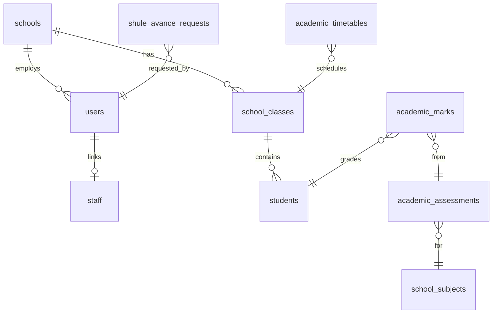

# Teacher Portal — Database & Authentication

## Authentication model

The Teacher Portal uses **cookie-based sessions** shared with the main Babyeyi platform. There is no JWT in localStorage for API calls.

### Login flow

1. User submits `identifier` (email or HR staff code), `password`, optional `schoolCode`.
2. `POST /api/auth/login` validates credentials and sets an httpOnly session cookie.
3. `AuthContext` calls `GET /api/session/me` and accepts only `role.code === 'TEACHER'`.
4. Non-teacher users are rejected and logged out immediately.

### SSO handoff

When redirected from the main Babyeyi app with `?sso_token=...`:

1. Token is stripped from the URL immediately.
2. `POST /api/auth/sso-verify` exchanges the token for a session.
3. On success, teacher state is set without re-entering password.

Implementation: `teacher-portal/src/context/AuthContext.jsx`

### Axios configuration

```javascript
// teacher-portal/src/services/api.js
axios.create({
  baseURL: '/api',           // or VITE_API_URL + '/api'
  withCredentials: true,     // required for session cookie
});
```

### Backend middleware

```javascript
// teacherPortal.js
function requireTeacherRole(req, res, next) {
  if (!req.session?.userId) {
    return res.status(401).json({ success: false, message: 'Not authenticated' });
  }
  next();
}
```

**Note:** Route middleware checks session presence. **Role `TEACHER` is enforced on the frontend** and in `portalOperations.js` for sensitive operations. Tighten server-side role checks when adding new endpoints.

### USSD auth (separate)

Teachers without web access use USSD with a **Bearer token** from `POST /avance/ussd/login`. Tokens are stored hashed in `teacher_avance_ussd_sessions` with TTL `TEACHER_USSD_SESSION_TTL_MINUTES` (default 30).

---

## Portal routing (Lite vs Pro)

| School type | Teacher lands on |
|-------------|------------------|
| Lite (no Pro) | `/lite/teacher` in BabyeyiSystem frontend |
| Pro | `babyeyipro` `/teacher` or standalone `ticha.babyeyi.rw` |

Logic: `BabyeyiSystem/frontend/src/utils/teacherPortalEntry.js`

Public marketing site links to `VITE_TEACHER_PORTAL_URL` (default `https://ticha.babyeyi.rw`).

---

## Database tables

Tables are bootstrapped by `ensureAcademicTables()` in `teacherPortal.js`. Core entities also read from shared platform tables (`users`, `students`, `schools`, `staff`, payroll).

### Academic & attendance

| Table | Purpose |
|-------|---------|
| `academic_timetables` | Class schedules |
| `academic_attendance_logs` | Attendance session headers |
| `academic_attendance_records` | Per-student attendance rows |
| `teacher_attendance_logs` | Teacher daily attendance |
| `attendance_class` | Class-period attendance header |
| `attendance_class_details` | Per-student period attendance |
| `attendance_student` | Student gate entry/exit |
| `attendance_teacher` | Teacher gate entry/exit |
| `attendance_teacher_class` | Teacher class-period check-in |
| `parent_notification_queue` | Parent attendance notifications |
| `teacher_round_roll_call_logs` | Roll call sessions |
| `teacher_round_roll_call_records` | Roll call per-student rows |

### Marks & academics

| Table | Purpose |
|-------|---------|
| `academic_assessments` | Assessments |
| `academic_marks` | Student marks |
| `school_classes` | School class registry |
| `school_subjects` | Subject catalog |
| `class_teacher_assignments` | Class teacher assignments |

Additional mark/gradebook columns may come from:

- `schoolGradebookSchema`
- `schoolMarksAcademicSchema`
- `teacherAssignmentsSchema`
- `competencySchema`

### Operations

| Table | Purpose |
|-------|---------|
| `student_permissions` | Permission requests |
| `portal_requisitions` | Finance requisitions (`portalOperations.js`) |

### TichaAvance (USSD)

| Table | Purpose |
|-------|---------|
| `teacher_avance_ussd_sessions` | USSD bearer sessions |
| `shule_avance_requests` | Advance/cashout/deal requests |

### Platform tables (read-only from portal)

| Table | Purpose |
|-------|---------|
| `users` | Login identity |
| `staff` | HR staff record, staff_id for USSD |
| `students` | Student roster |
| `schools` | School context, `shule_avance_max_percent` |
| `school_settings` | School configuration |

---

## Entity relationships (simplified)



---

## CORS & session origins

Backend `.env` must include teacher portal origins:

```
FRONTEND_URL=http://localhost:5173
ALLOWED_ORIGINS=http://localhost:5173,http://localhost:5174,https://ticha.babyeyi.rw
SESSION_SECRET=your-secret
```

Without these, cookies will not persist cross-origin in production.

---

## Security checklist for new features

1. Use `withCredentials: true` on all authenticated requests.
2. Validate `school_id` on the server from session, never trust client-only school IDs.
3. Filter students/classes by teacher assignments server-side.
4. Use `requireRole([...])` for finance and permission mutations.
5. Strip SSO tokens from URL after exchange.
6. Do not store passwords or session secrets in localStorage (only optional login prefs for identifier/school code).
