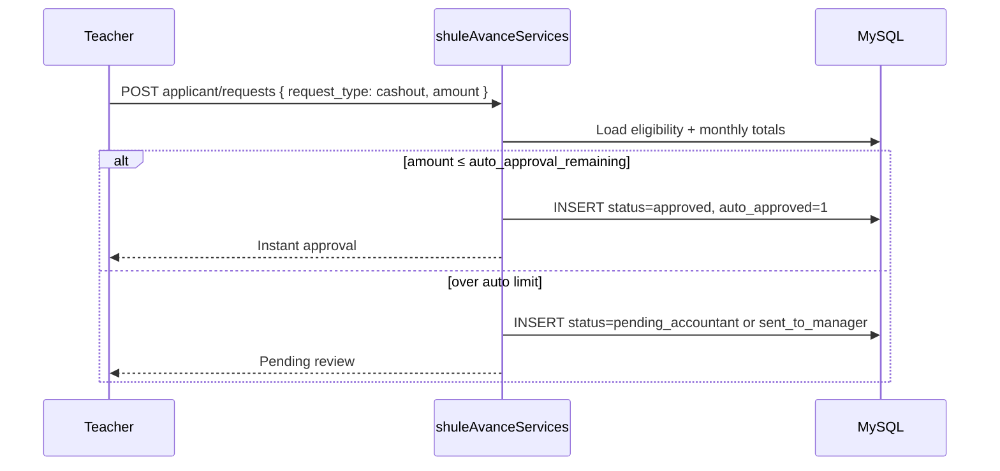

# TichaAvance — Features & Workflows

## Feature catalog

| Feature | Description | `request_type` | `service_category` |
|---------|-------------|----------------|-------------------|
| **Instant cashout** | Cash advance to mobile money / bank | `cashout` | catalog slug e.g. `general` |
| **Catalog services** | Cash power, airtime, water, rent, etc. | `service` | from `shule_avance_teacher_catalog` |
| **Invoice request** | Upload invoice, multi-step wizard | `service` | category from invoice |
| **TichaDeals** | Product marketplace | `service` | `teacher_deals` |
| **Repayment calculator** | Preview monthly deduction by term | — | UI only |
| **Request tracking** | List/edit/cancel pending requests | — | `my-requests` API |
| **Web push alerts** | Status transition notifications | — | push subscribe API |
| **USSD cashout** | Phone-based cashout | `cashout` | via teacher-portal USSD |

---

## 1. Eligibility dashboard

**On page load**, the UI fetches:

1. `GET /api/services/shule-avance/applicant/eligibility`
2. `GET /api/services/shule-avance/applicant/my-requests`
3. `GET /api/services/shule-avance/catalog`
4. `GET /api/staff/payroll/my` (payroll balance card)

**Displayed cards:**

- Net salary and monthly advance cap (% of net)
- Amount already requested this month
- Remaining eligibility
- Auto-approval limit for instant cashout

If `allowed: false`, creation buttons are disabled with `message` from API.

---

## 2. Cashout flow



**Request body (typical):**

```json
{
  "request_type": "cashout",
  "amount_rwf": 120000,
  "reason": "Medical emergency",
  "cashout_category_slug": "general",
  "repayment_term_months": 3
}
```

**Business rules:**

- Amount must not exceed `monthly_remaining_rwf`
- Cashout categories come from catalog (`type: cashout`)
- Repayment term: 1–18 months (UI `REPAYMENT_OPTIONS`)

---

## 3. Service request (catalog)

Teacher picks a service tile (cash power, airtime, groceries, etc.).

**Steps (`DIRECT_STEPS`):**

1. **Details** — amount, account/reference numbers, reason
2. **Repayment** — term months, review summary

**Request body:**

```json
{
  "request_type": "service",
  "service_category": "cash_power",
  "amount_rwf": 50000,
  "repayment_term_months": 6,
  "reason": "Electricity bill",
  "service_payload": { "meter_number": "..." }
}
```

Icons mapped by slug in `pickServiceIcon()` (Zap, Smartphone, etc.).

---

## 4. Invoice-based request

**Steps (`INVOICE_STEPS`):**

1. **Document** — upload invoice file
2. **Breakdown** — line items, vendor, amounts
3. **Terms** — repayment months, confirm

Larger invoice requests typically require accountant → manager approval on Pro schools.

**Accountant actions:**

- `PATCH .../finance/invoice-requests/:id/send-to-manager`
- `PATCH .../finance/invoice-requests/:id/reject`

---

## 5. Approval pipeline

### Pro schools

```
pending_accountant → sent_to_manager → approved
                  ↘ rejected_by_accountant
                                    ↘ rejected_by_manager
```

### Lite schools

```
pending (manager queue) → approved
                       ↘ rejected_by_manager
```

**Manager decision:**

`PATCH /api/services/shule-avance/manager/invoice-requests/:id/decision`

```json
{
  "decision": "approve",
  "manager_note": "Approved for term 4"
}
```

---

## 6. Request management (applicant)

| Action | API |
|--------|-----|
| List mine | `GET /applicant/my-requests` |
| Update pending | `PUT /applicant/requests/:id` |
| Cancel | `DELETE /applicant/requests/:id` |

UI shows status badges from `STATUS_MAP`, supports filter, edit (pencil), delete (trash), and in-app alerts on status transitions (`computeStatusTransitionAlerts`).

Status snapshots stored in `sessionStorage` per user to detect transitions between polls.

---

## 7. Repayment calculator

Component: `ShuleAvanceRepaymentCalculator.jsx`

- Input: principal, term months, optional interest from catalog
- Output: estimated monthly payroll deduction
- Used in wizards before submit

---

## 8. Web push subscription

On supported browsers, teacher can enable notifications:

1. `GET /applicant/push/vapid-key`
2. `POST /applicant/push/subscribe` with browser subscription JSON
3. Service worker `sw.js` handles `push` events with tag `ticha-avance`

Default notification click URL: `/shule-avance`

Utils: `webPushTeacherPortal.js` (shared between teacher-portal and BabyeyiSystem frontend).

---

## 9. School policy (manager)

Managers configure advance cap per school:

- `GET /api/school/shule-avance-policy`
- `PATCH /api/school/shule-avance-policy` — `shule_avance_max_percent`

Default: **25%** of net monthly salary.

---

## 10. Super Admin catalog

| Endpoint | Purpose |
|----------|---------|
| `/api/auth/shule-avance-teacher-catalog` | Service + cashout categories |
| `/api/services/shule-avance/admin/teacher-deal-products` | TichaDeals products |

Catalog entries define interest rates, slugs, icons, and active flag.

---

## Error codes (applicant create)

| Code | Meaning |
|------|---------|
| `ADVANCE_NOT_ALLOWED` | User/school not eligible |
| `EXCEEDS_MONTHLY_CAP` | Over monthly % cap |
| `VALIDATION_ERROR` | Missing/invalid fields |

Always show `message` from API to the user.
