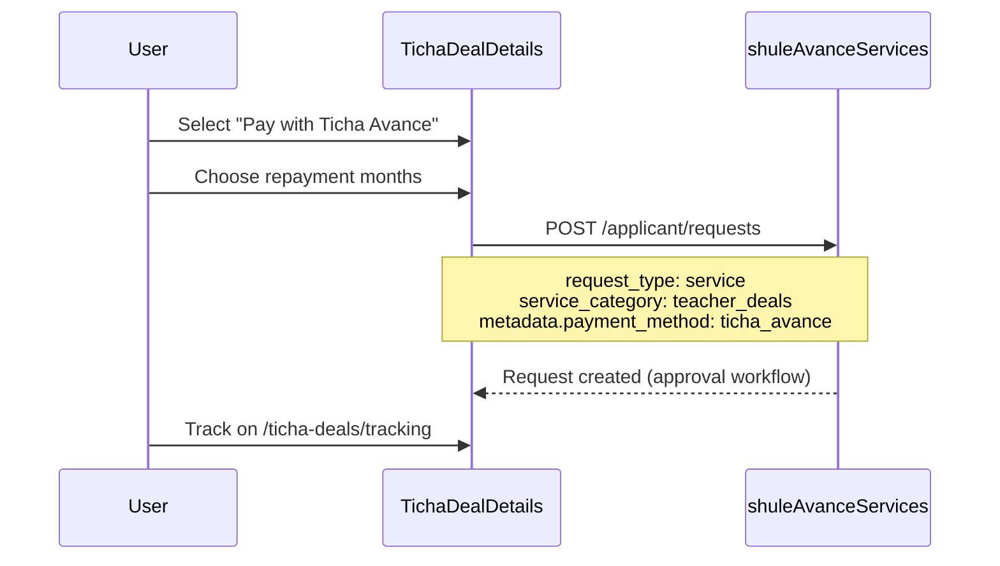
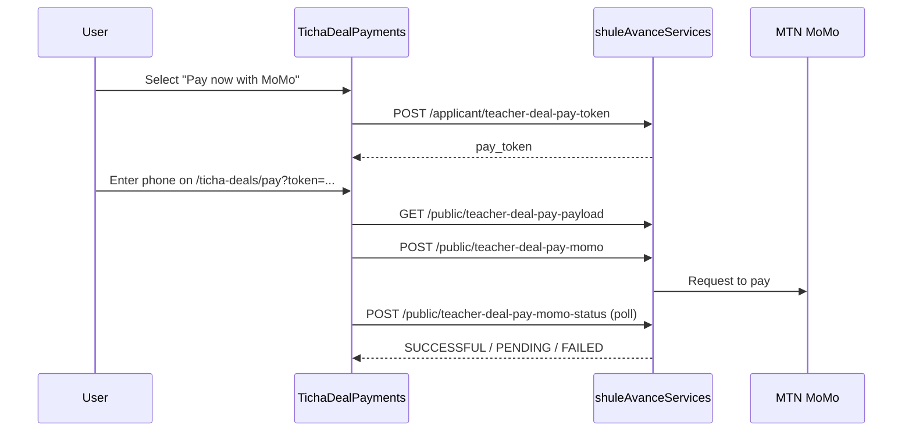

# TichaAvance — TichaDeals

TichaDeals is the **product marketplace** inside TichaAvance. Staff browse catalog products and pay either:

1. **`ticha_avance`** — payroll deduction over chosen months (financed advance)
2. **Direct MoMo** — immediate mobile money collection

---

## Routes

| Surface | Catalog | Detail | Tracking | Pay |
|---------|---------|--------|----------|-----|
| Teacher portal | `/ticha-deals` | `/ticha-deals/:id` | `/ticha-deals/tracking` | `/ticha-deals/pay` |
| Lite shell | `/lite/shule-avance/deals` | `.../deals/:id` | — | `.../pay` |

---

## Product catalog API

```
GET /api/services/shule-avance/teacher-deal-products
```

Returns active products from `shule_avance_teacher_deal_products`:

| Field | Purpose |
|-------|---------|
| `id` | Product ID |
| `name`, `description` | Display |
| `price_rwf` | Unit price |
| `image_path` | Relative path → resolve with `VITE_UPLOADS_BASE` |
| `is_active` | Visibility |
| `metadata_json` | Optional extras (variants, supplier) |

Admin CRUD: `/shule-avance/admin/teacher-deal-products` (SUPER_ADMIN).

---

## Checkout: payroll (`ticha_avance`)



**Request payload (conceptual):**

```json
{
  "request_type": "service",
  "service_category": "teacher_deals",
  "amount_rwf": 250000,
  "repayment_term_months": 6,
  "deal_lines": [
    {
      "product_id": 12,
      "name": "Samsung Tablet",
      "qty": 1,
      "unit_price_rwf": 250000
    }
  ],
  "metadata": {
    "payment_method": "ticha_avance",
    "delivery_notes": "..."
  }
}
```

After approval, repayment is scheduled against payroll (same as other service advances).

---

## Checkout: direct MoMo



Public endpoints do **not** require session; security is via short-lived `pay_token` in `shule_avance_teacher_deal_pay_tokens`.

---

## Tracking page

`TrackingTichaDeals.jsx` lists deal-related rows from `my-requests` filtered by `service_category === 'teacher_deals'`.

Displays:

- Product snapshot from `deal_products_snapshot_json`
- Payment type: `metadata.payment_method` → `ticha_avance` or `direct`
- Status badge (same `STATUS_MAP` as main Avance page)
- Repayment term and amount

---

## Shared components

`BabyeyiSystem/frontend/src/shared/staffTichaDeals/`:

| File | Role |
|------|------|
| `TichaDeals.jsx` | Product grid |
| `TichaDealDetails.jsx` | Detail + payment method modal |
| `TichaDealPayments.jsx` | MoMo flow |
| `createStaffTichaDeals.jsx` | Factory for embedding in lite DOS/discipline/accountant |

`babyeyipro` copies these under its frontend tree.

---

## Alternate payment intent

For partner financing or Babyeyi Pay:

```
POST /api/services/shule-avance/public/teacher-deal-pay-alt-intent
```

Used when MoMo is not the selected channel; integrates with `publicBabyeyiPay.js` and `pro_shule_avance_organizations`.

---

## Rwanda locations picker

Deal delivery forms may use:

```
GET /api/locations/provinces
GET /api/locations/districts
GET /api/locations/sectors
```

For province → district → sector cascades on checkout forms.

---

## Building TichaDeals from scratch

### Backend

1. Create `shule_avance_teacher_deal_products` table (already in `ensureShuleAvanceTables`)
2. Implement `GET teacher-deal-products` and admin CRUD
3. Extend `handleApplicantCreate` to accept `deal_lines` + snapshot JSON
4. Implement pay token + public MoMo routes
5. Wire MTN MoMo env vars

### Frontend

1. Product grid with image URLs from uploads base
2. Detail page with qty, total, repayment selector
3. Branch: payroll submit vs MoMo redirect to `/pay?token=`
4. Tracking page with status polling
5. Optional: embed in staff shell with bottom nav

### Admin

1. Super Admin UI for product CRUD (or use API directly)
2. Upload product images to school uploads path

---

## MoMo environment

Required in `BabyeyiSystem/backend/.env`:

```
MTN_MOMO_BASE_URL
MTN_MOMO_SUBSCRIPTION_KEY
MTN_MOMO_API_USER
MTN_MOMO_API_KEY
MTN_MOMO_TARGET_ENVIRONMENT=mtnrwanda
MTN_MOMO_CURRENCY=RWF
```

Aliases `MOMO_*` are also supported in code.

---

## Product vs cashout comparison

| Aspect | TichaDeals | Cashout |
|--------|------------|---------|
| `request_type` | `service` | `cashout` |
| `service_category` | `teacher_deals` | N/A (uses `cashout_category_slug`) |
| Payment | `ticha_avance` or MoMo | Payroll deduction only |
| Catalog table | `shule_avance_teacher_deal_products` | `shule_avance_teacher_catalog` (type cashout) |
| Public pay API | Yes (MoMo) | No |
