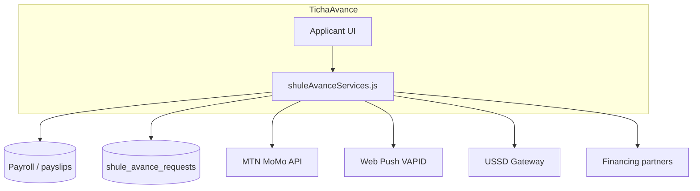

# TichaAvance — Integrations

External systems connected to TichaAvance and how to configure them.

---

## 1. Payroll (HR / Accountant)

**Purpose:** Net salary drives eligibility caps and auto-approval limits.

| API | Consumer |
|-----|----------|
| `GET /api/staff/payroll/my` | TichaAvance UI payroll card |
| `GET /api/teacher-portal/staff/payroll/my` | Teacher portal alias |

**Data used:**

- Latest payslip net pay → `net_salary_baseline_rwf`
- Monthly cap = `net × shule_avance_max_percent / 100`

**Requirement:** Staff must be on payroll with at least one processed payslip for meaningful eligibility. Without net salary, `allowed` may be false.

Related docs: `babyeyipro/docs/accountant-payroll/`

---

## 2. MTN MoMo Collection

**Purpose:** Direct payment for TichaDeals (non-payroll path).

**Module:** `mtnMomoCollection.js` (called from `shuleAvanceServices.js` public routes)

**Flow:**

1. `POST /applicant/teacher-deal-pay-token` (authenticated)
2. `POST /public/teacher-deal-pay-momo` with token + `payer_phone`
3. Poll `POST /public/teacher-deal-pay-momo-status`

**Environment variables:**

| Variable | Alias |
|----------|-------|
| `MTN_MOMO_BASE_URL` | `MOMO_BASE_URL` |
| `MTN_MOMO_SUBSCRIPTION_KEY` | `MOMO_SUBSCRIPTION_KEY` |
| `MTN_MOMO_API_USER` | `MOMO_API_USER_ID` |
| `MTN_MOMO_API_KEY` | `MOMO_API_KEY` |
| `MTN_MOMO_TARGET_ENVIRONMENT` | default `mtnrwanda` |
| `MTN_MOMO_CURRENCY` | default `RWF` |
| `MTN_MOMO_HOSO_PAY_BASE` | optional secondary step |

**Tables:** `shule_avance_teacher_deal_pay_tokens`, payment status on request or intent rows.

---

## 3. Web Push (VAPID)

**Purpose:** Notify applicants when request status changes (approved, sent to manager, rejected).

**Tag:** `ticha-avance`  
**Default click URL:** `/shule-avance`

**Frontend:**

- `webPushTeacherPortal.js` — subscribe flow
- `teacher-portal/public/sw.js` — service worker
- `BabyeyiSystem/frontend/public/sw.js` — Lite copy

**Backend:**

- `webPushSubscriptions.js`
- Routes under `/shule-avance/applicant/push/*`

**Environment:**

```
VAPID_PUBLIC_KEY=
VAPID_PRIVATE_KEY=
VAPID_SUBJECT=mailto:admin@yourdomain.rw
```

Key generation guide: `BabyeyiSystem/backend/docs/WEB_PUSH_VAPID.md`

---

## 4. USSD (teachers without smartphone)

**Purpose:** Login and cashout via USSD menu integrated with mobile network.

**Mount:** `/api/teacher-portal/avance/ussd/*` in `teacherPortal.js`

| Endpoint | Action |
|----------|--------|
| `POST .../login` | `identifier` + `password` + `school_code` → Bearer token |
| `POST .../cashout-request` | Create cashout |
| `GET .../requests` | List statuses |

**Session table:** `teacher_avance_ussd_sessions` (hashed token)  
**TTL:** `TEACHER_USSD_SESSION_TTL_MINUTES` (default 30)

**Identifier resolution order:**

1. `staff.staff_id` (preferred — HR Central staff code)
2. `users.user_uid`
3. `staff.username` + `school_code`

Full API doc: [../teacher-avance-ussd-api.md](../teacher-avance-ussd-api.md)

---

## 5. Babyeyi Pay & financing partners

**Purpose:** Route large payments through registered financing organizations.

| API | Role |
|-----|------|
| `GET /api/public/babyeyi-pay/shule-avance-organizations` | List partners for picker |
| `POST .../public/teacher-deal-pay-alt-intent` | Create alternate intent |
| `/api/shule-avance-partner/*` | Partner review dashboard |

**Tables:** `pro_shule_avance_organizations`, `babyeyi_payment_intents` (via `publicBabyeyiPay.js`)

**Partner role:** `SHULE_AVANCE_PARTNER` → UI at `/shule-avance/dashboard`

---

## 6. SMTP notifications

Financing application emails sent from `publicBabyeyiPay.js` when configured:

```
SMTP_HOST
SMTP_PORT
SMTP_USER
SMTP_PASS
SMTP_FROM
```

Optional; not required for core advance workflow.

---

## 7. School subscription (Pro vs Lite)

**Function:** `computeProAccessEffective(schoolId)`

| Effect | Pro | Lite |
|--------|-----|------|
| Accountant step | Yes | Skipped |
| Initial status | `pending_accountant` | Manager queue |
| Feature gating | Full finance module | Simplified |

Implemented inside `handleApplicantCreate` in `shuleAvanceServices.js`.

---

## Integration diagram



---

## Deployment checklist

| Integration | Check |
|-------------|-------|
| Payroll | Test user has payslip with net > 0 |
| MoMo | Sandbox credentials; callback URL if required |
| Web Push | HTTPS in production; SW registered |
| USSD | Token TTL; school_code required |
| CORS | Applicant portals in `ALLOWED_ORIGINS` |
| Uploads | `VITE_UPLOADS_BASE` for deal images |

---

## TichaAI (not part of TichaAvance)

`/api/tools/ticha-ai/*` powers the **TichaAI** assistant in the teacher portal. It shares branding but is a separate tools module with no financial transactions.
