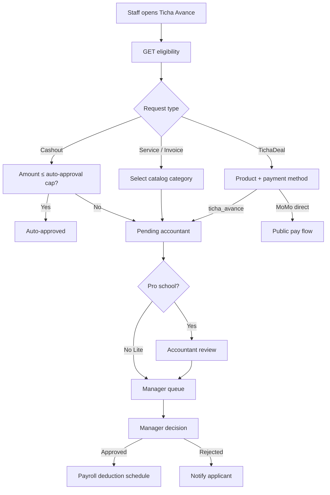

# TichaAvance — Developer Documentation

> **Product name:** Ticha Avance (teacher-facing brand)  
> **System name:** ShuleAvance (backend, routes, database)  
> **Payment method key:** `ticha_avance` (payroll deduction)  
> **Backend module:** `BabyeyiSystem/backend/BabyeyiRoutes/shuleAvanceServices.js`  
> **API prefix:** `/api/services/shule-avance/*`

TichaAvance lets school staff—especially teachers—request **salary advances** and pay for services or products, repaying over 1–18 months through payroll deduction. It includes cashouts, invoice-based requests, a **TichaDeals** marketplace, web push notifications, and USSD cashout for teachers without web access.

---

## Naming guide

| Name | Where it appears |
|------|------------------|
| **Ticha Avance** | UI labels, push notification titles, Lite sidebar |
| **Shule Avance** | Route paths (`/shule-avance`), nav in teacher portal |
| `shule-avance` | API paths, URL segments |
| `ticha_avance` | `payment_method` in deal request metadata |
| `ticha-avance` | Web push notification tag |
| **TichaDeals** | Product marketplace submodule |

There is **no standalone `TichaAvance` repository**—it is a feature module inside BabyeyiSystem with UI copies in `teacher-portal`, Lite staff shell, and embedded portals.

---

## Who this guide is for

Developers rebuilding or extending payroll-advance financing: eligibility rules, approval workflows, deal checkout, MoMo payments, and USSD.

---

## Frontend surfaces

| Surface | Route | Primary component |
|---------|-------|-------------------|
| **Teacher portal (standalone)** | `/shule-avance` | `teacher-portal/src/pages/ShuleAvance.jsx` |
| **Lite staff shell** | `/lite/shule-avance` | `LiteTichaAvancePage.jsx` |
| **Lite TichaDeals** | `/lite/shule-avance/deals` | `LiteTichaDealsPage.jsx` |
| **Teacher portal deals** | `/ticha-deals/*` | `TichaDeals.jsx`, `TichaDealDetails.jsx` |
| **Embedded teacher (lite)** | `/lite/teacher` → Shule Avance | `lite/teacher/pages/ShuleAvance.jsx` |
| **Accountant review** | Accountant portal | `AccountantShuleAvance.jsx` |
| **Manager approval** | Manager portal | `ShuleAvanceFinanceApprovals.jsx` |
| **Super Admin** | `/superadmin/shule-avance-*` | Catalog + partner org admin |
| **Partner portal** | `/shule-avance/dashboard` | `SHULE_AVANCE_PARTNER` role |

Shared deal components: `BabyeyiSystem/frontend/src/shared/staffTichaDeals/`

---

## Core documentation

| Doc | Contents |
|-----|----------|
| [00-architecture](./00-architecture.md) | Module layout, tables, role matrix |
| [01-features-and-workflows](./01-features-and-workflows.md) | Cashout, services, invoices, approval pipeline |
| [02-api-reference](./02-api-reference.md) | All REST endpoints |
| [03-frontend-guide](./03-frontend-guide.md) | UI components, state, wizards |
| [04-ticha-deals](./04-ticha-deals.md) | Marketplace, MoMo vs payroll pay |
| [05-integrations](./05-integrations.md) | USSD, web push, MoMo, payroll |

---

## Related documentation

| Topic | Location |
|-------|----------|
| Teacher portal overview | [../teacher-portal/README.md](../teacher-portal/README.md) |
| USSD API | [../teacher-avance-ussd-api.md](../teacher-avance-ussd-api.md) |
| Web Push VAPID | `BabyeyiSystem/backend/docs/WEB_PUSH_VAPID.md` |

---

## High-level workflow



---

## Quick start

```powershell
# Backend (required)
cd BabyeyiSystem/backend
npm run dev

# Teacher portal TichaAvance UI
cd teacher-portal
npm run dev
# → http://localhost:5173/shule-avance

# Lite staff TichaAvance UI
cd BabyeyiSystem/frontend
npm run dev
# → http://localhost:5173/lite/shule-avance (after staff login)
```

Staff must have payroll net salary on file for eligibility to show meaningful caps.

---

## Key source files

| File | Role |
|------|------|
| `shuleAvanceServices.js` | All business logic + table bootstrap |
| `shuleAvanceCatalogStore.js` | Service/cashout catalog |
| `LiteTichaAvancePage.jsx` | Lite branded dashboard |
| `ShuleAvance.jsx` (teacher-portal) | Teacher portal dashboard |
| `ShuleAvanceRepaymentCalculator.jsx` | Repayment term UI |
| `shared/staffTichaDeals/TichaDealDetails.jsx` | Deal checkout + `ticha_avance` |
